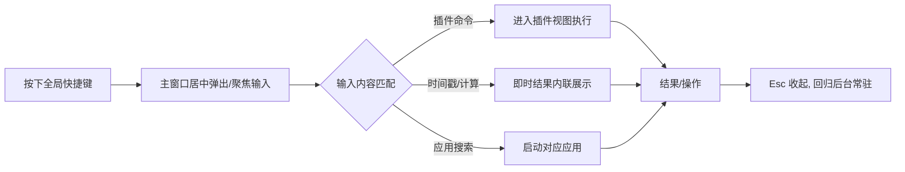

# Deskit 产品需求文档（PRD）

| 项 | 内容 |
| --- | --- |
| 文档状态 | ✅ Reviewed |
| 版本 | v1.2 |
| 作者 | 产品组 |
| 评审人 | Tech Lead / 设计 / QA |
| 最近更新 | 2026-05-22（对齐课题：插件机制 P0=本地加载+内置列表+mock registry，服务端市场降为挑战；悬浮球/换肤回归主程序 P0；截图标注/马赛克归为挑战） |
| 关联文档 | [竞品分析](./competitive-analysis.md) · [技术选型](../01-tech-selection/tech-selection.md) · [实施规划](../04-implementation/roadmap.md) |

---

## 1. 背景与问题陈述

桌面用户在日常工作中频繁进行**碎片化高频操作**：查找应用、转换时间戳、检索剪贴板历史、跨设备传文件、截图标注……这些操作分散在不同工具中，存在三大痛点：

1. **入口分散**：每个功能一个 App，启动/切换成本高，打断心流。
2. **能力固化**：内置功能无法满足长尾需求，用户无法自行扩展。
3. **数据孤岛**：设置、剪贴板、插件配置无法跨设备同步。

uTools/Alfred/Raycast 验证了"**统一唤起入口 + 可扩展插件生态**"是解法。本项目（Deskit）面向该场景，构建一个**快捷键唤起、插件可扩展、数据可同步、跨平台**的桌面提效工具箱。

## 2. 产品目标与非目标

### 2.1 目标（Goals）
- **G1 极速入口**：全局快捷键 < 300ms 唤起，输入即用，键盘优先。
- **G2 开放生态**：提供插件市场 + 本地开发安装 + 开发者文档，让第三方扩展能力。
- **G3 数据无缝**：用户设置、插件设置、剪贴板历史跨设备端到端加密同步。
- **G4 一体体验**：多语言、深浅色、换肤、悬浮球，覆盖主流桌面平台（Win/macOS，Linux 尽力支持）。
- **G5 安全可信**：插件运行在受限沙箱，权限可控，防止数据窃取与恶意攻击。

### 2.2 非目标（Non-Goals，本期不做）
- ❌ 移动端（iOS/Android）。
- ❌ Web 版本。
- ❌ 团队协作 / 多人共享空间（仅个人跨设备同步）。
- ❌ 插件内购 / 商业化结算系统（市场仅免费分发）。
- ❌ AI 大模型对话能力（可作为后续插件，非主程序内置）。

## 3. 目标用户与画像

| 画像 | 描述 | 核心诉求 | 关键功能 |
| --- | --- | --- | --- |
| **效率极客 Eric** | 程序员/设计师，重度键盘用户 | 一切皆可快捷键，可自定义插件 | 命令面板、本地插件开发、剪贴板 |
| **办公白领 Wendy** | 运营/产品，多设备办公 | 开箱即用、跨设备同步、好看 | 换肤、深浅色、设置同步、截图 |
| **插件开发者 Dave** | 想为工具箱写扩展 | 文档清晰、SDK 好用、可上架 | 开发者文档、SDK、市场上传 |

## 4. 用户故事（User Stories）

> 格式：作为 `<角色>`，我希望 `<能力>`，以便 `<价值>`。验收以 FR 编号关联。

- **US-1**（Eric）按下快捷键即可在任意界面唤起搜索框，输入关键字直达功能 → `FR-001/002`
- **US-2**（Wendy）固定一个桌面悬浮球，点击即唤起工具箱 → `FR-003`
- **US-3**（Wendy）一键在中文/英文、深色/浅色、不同皮肤间切换 → `FR-004/005/006`
- **US-4**（Dave）在市场上传我开发的插件，其他用户可搜索安装（挑战）→ `FR-011`
- **US-5**（Eric）把本地开发的插件直接装进工具箱调试 → `FR-012`
- **US-6**（Wendy）插件有新版本时收到提示并一键更新 → `FR-014`
- **US-7**（所有人）插件不能偷偷读取我的隐私数据或攻击服务器 → `FR-015`
- **US-8**（Eric）输入时间戳秒/毫秒，立即看到对应日期时间，反之亦然，可选时区 → `FR-020~023`
- **US-9**（Wendy）在公司电脑设置好，回家用个人电脑自动同步 → `FR-030/031`
- **US-10**（Eric）复制过的文本/图片/文件能在历史里找到、收藏、分组 → `FR-040~043`
- **US-11**（Wendy）把文件/文字快速发给同一 WiFi 下的另一台设备 → `FR-050/051`
- **US-12**（所有人）截取屏幕选区、贴图到桌面、加箭头/马赛克标注 → `FR-060~063`

## 5. 功能需求（Functional Requirements）

> 优先级沿用课题。每条含**验收标准（AC）**，可直接转测试用例。
> 应用组按最新定位区分：**三个 P0 内置应用 = 时间戳（§5.3）/ 历史剪贴板（§5.4）/ 截图（§5.5）**；数据同步（§5.6）与局域网共享（§5.7）为 P1。
> 插件机制（§5.2）P0 仅含**本地加载 + 内置列表 + mock registry**，真实服务端市场为挑战项。剪贴板跨设备同步（FR-043）为 P0，设置/插件同步（FR-030/031）为 P1。

### 5.1 【P0】主程序（核心框架）

| 编号 | 需求 | 验收标准（AC） | 优先级 |
| --- | --- | --- | --- |
| FR-001 | 全局快捷键唤醒 | 默认 `Alt+Space`（可改）；任意应用前台时按下，主窗口 **300ms 内**居中弹出并聚焦输入框；再次按下隐藏 | P0 |
| FR-002 | 指令直达功能 | 输入框支持模糊搜索（中文/英文/拼音首字母）；回车执行首项；↑↓ 选择；命中插件/系统命令/计算结果 | P0 |
| FR-003 | 桌面悬浮球 | 可开关；无边框圆形置顶窗口；可拖拽吸边；单击唤起主窗、右键菜单；多屏正确显示 | P0 |
| FR-004 | 多语言 | 至少中/英；运行时切换无需重启；插件可注册自身语言包；跟随系统语言为默认 | P0 |
| FR-005 | 深浅色模式 | 浅色/深色/跟随系统三态；切换实时生效（含已开插件） | P0 |
| FR-006 | 换肤 | 内置 ≥3 套主题；通过 CSS 变量驱动；用户可自定义主色；插件继承主题变量 | P0 |

### 5.2 【P0】插件机制（可扩展内核）

> 课题定位：**追求"设计一个能支撑应用市场的扩展架构"，而非"2 周做一个完整应用市场"**。故 **P0 = 本地插件加载 + 内置插件列表 UI + 预留 registry 接口（mock JSON 模拟远程市场）**；真实服务端市场（浏览/上传/安装/审核/签名）与市场更新、服务端防滥用均为【挑战/P1】。

| 编号     | 需求         | 验收标准（AC）                                                 | 优先级      |
| ------ | ---------- | -------------------------------------------------------- | -------- |
| FR-010 | 插件加载与内置市场（mock） | 本地插件扫描/加载/生命周期；内置插件列表 UI（分类/搜索/启停/卸载）；预留 registry 接口并以 **mock JSON** 模拟远程市场浏览/安装 | **P0** |
| FR-011 | 应用市场服务端（浏览/上传/安装） | 真实远程市场后端：列表/详情/评分/下载；登录上传，服务端校验 manifest/签名/体积、审核状态可见；一键安装/卸载/启停 | 挑战 ⭐⭐⭐ |
| FR-012 | 本地插件开发安装   | "开发者模式"导入本地插件目录；保存即热重载；可查看插件控制台日志                        | **P0** |
| FR-013 | 开发者文档 Demo | 提供 SDK、API 文档、Hello-World 模板、`create-deskit-plugin` CLI | P1 挑战 ⭐⭐⭐ |
| FR-014 | 市场应用更新     | 检测新版本并提示；支持增量/全量更新；更新失败可回滚；变更日志可见                        | P1 挑战 ⭐⭐⭐⭐ |
| FR-015 | 数据安全与防恶意   | 插件运行于沙箱；能力清单（权限）声明+用户授权；网络/文件访问受控；服务端防滥用（限流/签名/扫描）       | P1 挑战 ⭐⭐⭐⭐⭐ |

> 注：FR-015 的**插件沙箱/能力清单/CSP 安全基线**属 P0 内核必做（见 [安全设计](../02-architecture/security.md)）；表中⭐⭐⭐⭐⭐指向的**服务端防滥用（限流/扫描）**为挑战项。

### 5.3 【P0】时间戳转换应用（内置插件示范）

| 编号 | 需求 | 验收标准（AC） | 优先级 |
| --- | --- | --- | --- |
| FR-020 | 时间戳→日期 | 输入数字时间戳，实时显示可读日期时间 | P0 |
| FR-021 | 日期→时间戳 | 输入/选择日期时间，实时生成时间戳 | P0 |
| FR-022 | 秒/毫秒切换 | 自动识别 10/13 位并可手动指定单位 | P0 |
| FR-023 | 时区选择 | 可选目标时区（默认本地）；切换实时换算；DST 正确 | P0 ⭐⭐ |

### 5.4 【P0】历史剪贴板应用

| 编号     | 需求    | 验收标准（AC）                 | 优先级 |
| ------ | ----- | ------------------------ | --- |
| FR-040 | 多类型记录 | 自动记录文本/图片/文件路径；时间线展示；可搜索 | P0  |
| FR-041 | 分组    | 支持按类型/自定义标签分组            | P0  |
| FR-042 | 收藏    | 可收藏条目，置顶常用               | P0  |
| FR-043 | 跨设备同步 | 剪贴板历史端到端加密同步（可关闭/限条数）    | P0  |

### 5.5 【P0】截图应用

> 截图应用本身为 P0（三个内置应用之一）；课题中其各项能力均带挑战难度。**P0 承诺 = 选区截图 + 贴图**；**标注、马赛克为挑战项**。

| 编号     | 需求   | 验收标准（AC）                   | 优先级     |
| ------ | ---- | -------------------------- | ------- |
| FR-060 | 选区截图 | 快捷键触发；全屏遮罩可拖拽选区；放大镜取色；多屏支持 | P0 ⭐⭐⭐  |
| FR-061 | 贴图   | 截图后"钉"到桌面为置顶小窗，可拖动/缩放/关闭   | P0 ⭐⭐⭐  |
| FR-062 | 标注   | 矩形/箭头/画笔/文字/序号；可撤销重做       | 挑战 ⭐⭐⭐⭐ |
| FR-063 | 马赛克  | 选区打码（像素化/模糊）               | 挑战 ⭐⭐⭐⭐ |

### 5.6 【P1】数据同步

| 编号     | 需求     | 验收标准（AC）                         | 优先级 |
| ------ | ------ | -------------------------------- | --- |
| FR-030 | 用户设置同步 | 登录后语言/主题/快捷键等设置跨设备一致；离线可用，联网增量同步 | P1  |
| FR-031 | 插件设置同步 | 各插件配置纳入同步；冲突按策略合并并可查看            | P1  |

### 5.7 【P1】局域网共享

| 编号 | 需求 | 验收标准（AC） | 优先级 |
| --- | --- | --- | --- |
| FR-050 | 设备发现 | 同局域网自动发现在线设备（mDNS）；显示设备名 | P1 |
| FR-051 | 文件/文本传输 | 选择设备发送文本/文件；接收方确认后落盘；显示进度；支持大文件 | P1 ⭐⭐ |

## 6. 非功能需求（NFR）

| 编号     | 类别   | 指标                                                         |
| ------ | ---- | ---------------------------------------------------------- |
| NFR-01 | 性能   | 冷启动 < 2s；快捷键唤起 < 300ms；搜索响应 < 50ms（千级条目）；空闲内存 < 200MB      |
| NFR-02 | 兼容   | Windows 10/11、macOS 12+；Linux（Ubuntu 22.04）尽力支持            |
| NFR-03 | 安全   | 见 [安全设计](../02-architecture/security.md)：沙箱、权限、E2E 加密、签名校验 |
| NFR-04 | 可用性  | 崩溃率 < 0.5%；自动更新成功率 > 99%；离线可用核心功能                          |
| NFR-05 | 可观测  | 崩溃上报、关键埋点、可关闭遥测；本地日志可导出                                    |
| NFR-06 | 可维护  | 单测覆盖率核心模块 ≥ 70%；CI 全绿才可合并                                  |
| NFR-07 | 国际化  | 文案 100% 走 i18n；不硬编码；支持 RTL 预留                              |
| NFR-08 | 隐私合规 | 数据默认本地；同步需显式登录授权；遵循最小权限；提供数据导出/删除                          |
| NFR-09 | 包体   | 安装包 < 120MB；增量更新包尽量小                                       |

## 7. 范围与版本切分（Release Scope）

| 版本 | 范围 | 目标 |
| --- | --- | --- |
| **MVP（M1）** | 主程序框架 + 快捷键 + 命令面板 + 时间戳功能（内置 Provider）+ 深浅色/多语言 | 跑通"唤起→搜索→执行功能"主链路 |
| **Alpha（M2）** | 插件系统（加载/隔离）+ 内置列表 + mock registry + 本地插件开发安装 + 悬浮球 + 换肤 | 可扩展内核成立 |
| **Beta（M3）** | 剪贴板（含端到端加密同步）+ 截图（选区/贴图） | 三个 P0 应用齐备 |
| **RC/1.0（M4）** | 安全基线 + 自动更新 + 发布；行有余力：应用市场服务端（挑战）+ 市场更新 + 截图标注/马赛克 + 数据同步（P1）+ 局域网共享（P1） | 可发布 + 挑战/P1 尽力交付 |

详见 [实施规划](../04-implementation/roadmap.md)。

## 8. 成功指标（北极星与过程指标）

- **北极星指标**：周活跃用户的**人均每日有效命令执行次数**（衡量"提效"是否真发生）。
- 过程指标：
  - 安装到首次成功执行命令的转化率（激活率）≥ 60%。
  - 插件市场安装过插件的用户占比 ≥ 30%（生态健康度）。
  - 启用跨设备同步的用户占比 ≥ 20%。
  - 7 日留存 ≥ 35%。
  - 崩溃率 < 0.5%，唤起 P95 延迟 < 300ms（体验质量）。

## 9. 关键流程（用户视角）

## 10. 依赖、假设与开放问题

- **依赖**：剪贴板同步需精简自建后端（NestJS）；应用市场服务端为挑战项（行有余力再做）；代码签名证书（macOS/Windows）需提前申请。
- **假设**：用户有基本快捷键习惯；同步用户愿意注册账号。
- **开放问题（待评审）**：
  1. 同步后端自建 vs 复用对象存储（WebDAV/S3）作为可插拔后端？→ 见 [数据同步设计](../02-architecture/data-sync.md)。
  2. 插件分发是否需要人工审核 + 自动扫描双轨？→ 见 [安全设计](../02-architecture/security.md)。
  3. Linux 作为"尽力支持"还是一等公民？→ 进度风险，见 [风险登记册](../05-quality/risk-management.md)。

## 11. 需求-测试可追溯矩阵（RTM 摘要）

完整矩阵见 [测试方案](../05-quality/test-plan.md)。每个 `FR-xxx` 至少对应一个 `TC-xxx`，CI 阶段校验关联完整性，确保**需求不漏测**。
