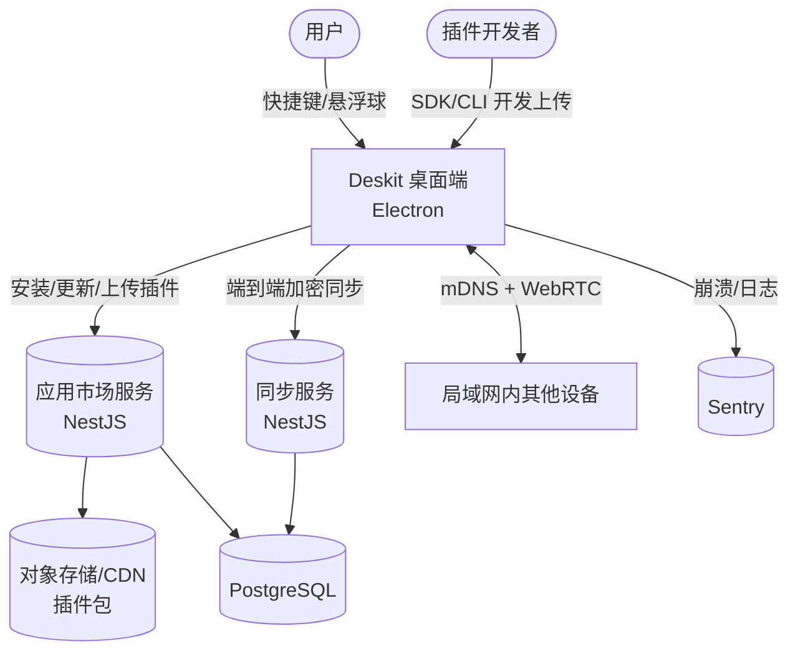
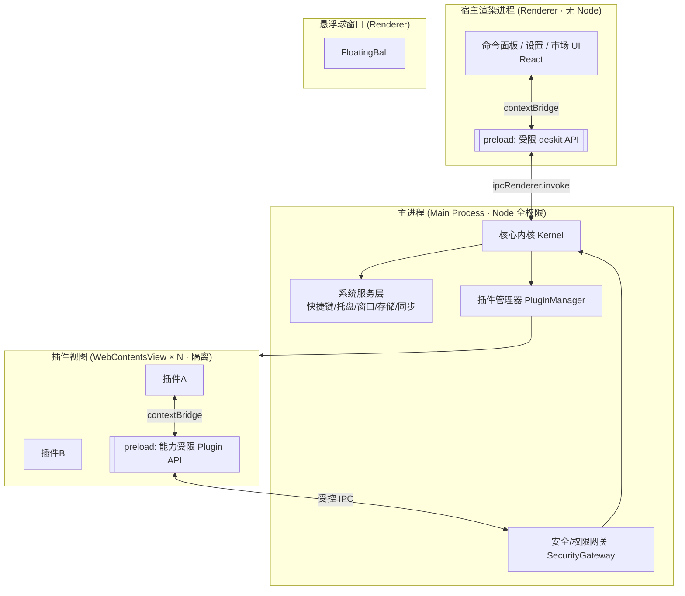
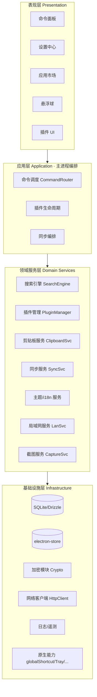
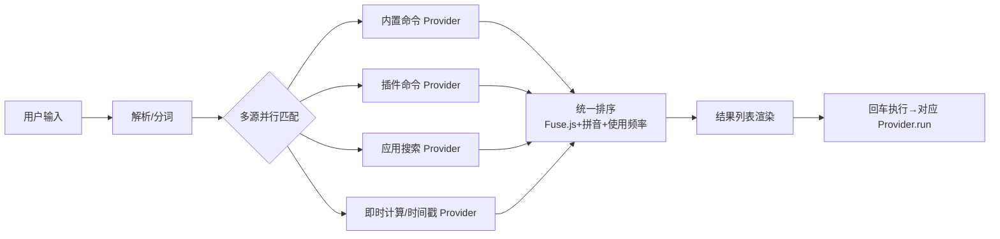
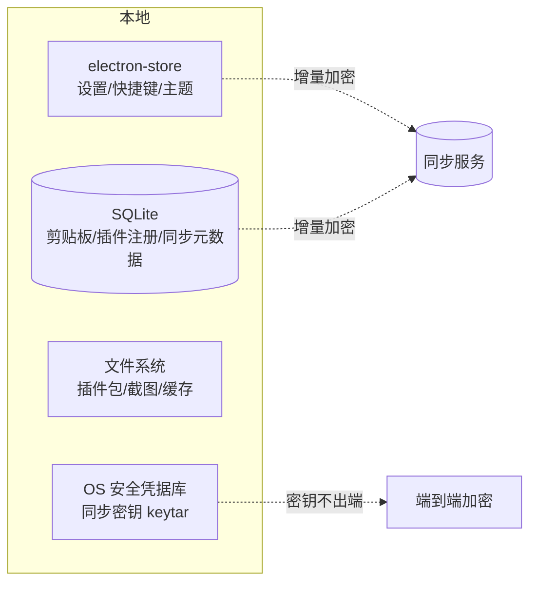
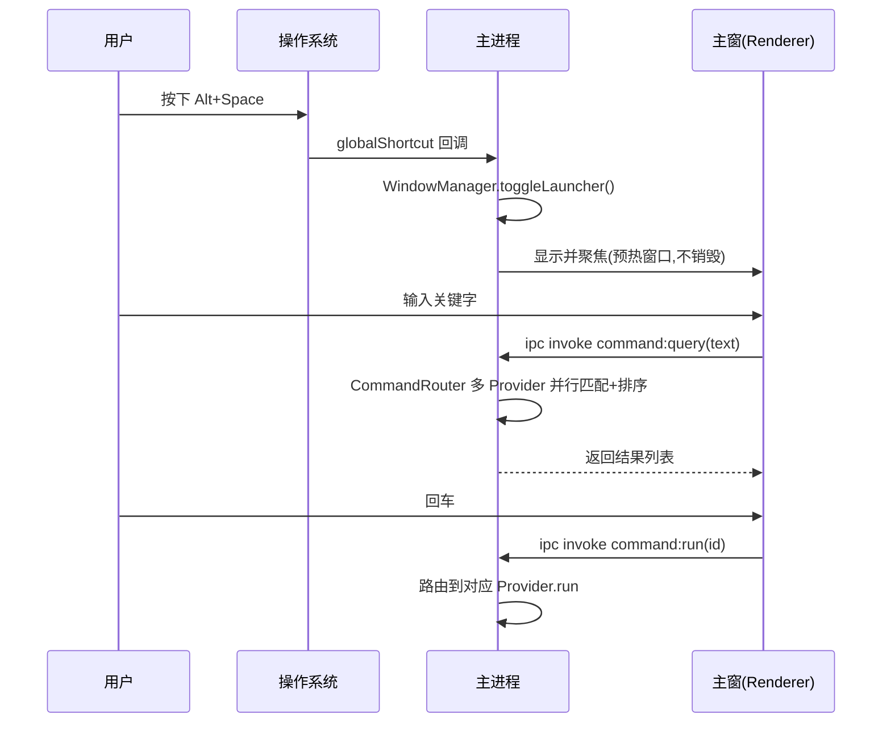
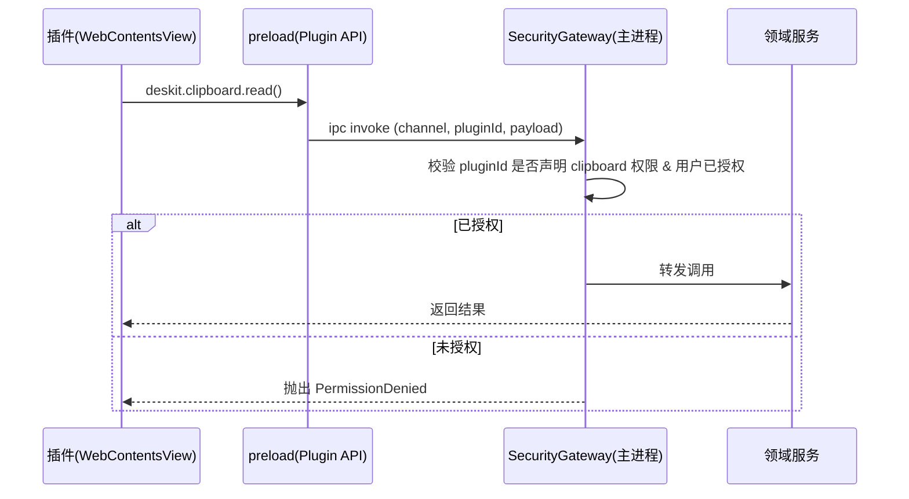

# Deskit 系统架构设计

| 项 | 内容 |
| --- | --- |
| 文档状态 | ✅ Reviewed |
| 版本 | v1.0 |
| 关联 | [技术选型](../01-tech-selection/tech-selection.md) · [插件系统](./plugin-system.md) · [安全设计](./security.md) · [API/IPC](../03-design/api-ipc.md) |

---

## 1. 架构总览（C4 - Context）



## 2. 进程模型（Electron 多进程）

Deskit 遵循 Electron 安全最佳实践：**主进程掌权、渲染进程零 Node、插件进程隔离**。



**关键原则**（详见 [安全设计](./security.md)）：
- 所有渲染进程 `nodeIntegration:false`、`contextIsolation:true`、`sandbox:true`。
- 渲染层只能通过 `contextBridge` 暴露的**白名单 API** 与主进程通信。
- 插件视图的 IPC 必须经 **SecurityGateway** 校验权限后才转发到核心服务。

## 3. 分层架构（逻辑分层）



| 层 | 职责 | 不可做 |
| --- | --- | --- |
| 表现层 | 渲染、交互、状态展示 | 直接访问文件/网络/数据库 |
| 应用层 | 编排用例、路由命令、协调服务 | 写具体业务算法 |
| 领域服务层 | 业务逻辑（搜索/插件/同步/剪贴板） | 关心 UI/具体存储实现 |
| 基础设施层 | 存储/加密/网络/原生 API 适配 | 含业务规则 |

## 4. 核心模块设计

### 4.1 命令调度内核（CommandRouter）
命令面板的"大脑"，将用户输入路由到不同处理器：



- **Provider 模式**：每类结果源实现统一 `CommandProvider` 接口（`query()` / `run()`），内置功能与插件平权接入。
- **排序**：模糊匹配分 + 拼音匹配 + 历史使用频率（LRU/频次加权），保证常用命令置顶。
- **性能**：`useTransition` + 防抖 + Web Worker 内匹配，保证输入 < 50ms 响应（NFR-01）。

### 4.2 窗口管理（WindowManager）
| 窗口 | 类型 | 特性 |
| --- | --- | --- |
| 主窗（命令面板） | 无边框、居中、失焦自动隐藏 | 快捷键唤起，常驻后台 |
| 悬浮球 | 无边框、透明、置顶、可拖拽吸边 | 多屏适配，单击唤主窗 |
| 设置/市场 | 标准窗口 | 独立打开 |
| 插件视图 | `WebContentsView` 挂载于主窗 | 池化复用，隔离 |
| 截图遮罩 | 全屏透明置顶 | 多屏拼接坐标系 |
| 贴图窗 | 无边框置顶小窗 | 每张图一个实例 |

### 4.3 主题与设计令牌系统（满足 FR-005/006）
- 设计令牌（Design Tokens）以 CSS 变量承载，分三层：**基础调色板 → 语义令牌 → 组件令牌**。

```css
:root {                 /* 语义令牌（浅色） */
  --fx-color-bg: #ffffff;
  --fx-color-fg: #1f2329;
  --fx-color-primary: #3370ff;   /* 飞书蓝，可被换肤覆盖 */
  --fx-radius-md: 8px;
}
[data-theme="dark"] {   /* 深色覆盖 */
  --fx-color-bg: #1f1f1f;
  --fx-color-fg: #e8e8e8;
}
[data-skin="forest"] {  /* 换肤：仅改主色族 */
  --fx-color-primary: #2bab6b;
}
```

- **运行时切换**：JS 改 `<html data-theme data-skin>` 属性即可，**无重渲染成本**。
- **插件继承**：插件 `WebContentsView` 注入同一份令牌 CSS，主程序广播 `theme:changed` 事件，插件实时跟随（满足"切换实时生效含已开插件"）。
- 用户自定义主色 → 写入 `electron-store` → 同步服务下发到其他设备。

### 4.4 国际化（i18n）
- `i18next` + `react-i18next`，命名空间按模块拆分，懒加载。
- 语言资源：`packages/shared/locales/{zh-CN,en-US}/*.json`。
- 插件可注册自身语言包，主程序合并命名空间。
- 默认跟随系统语言（`app.getLocale()`），用户可覆盖并同步。

### 4.5 存储拓扑


详细 schema 见 [数据模型](../03-design/data-model.md)。

## 5. 关键时序

### 5.1 快捷键唤起命令面板（FR-001/002）

> 性能关键：主窗**预创建并隐藏**（非每次新建），唤起即 show，达成 < 300ms（NFR-01）。

### 5.2 插件调用受控能力（与安全联动）


## 6. 目录结构（apps/desktop）

```text
apps/desktop/src/
├─ main/                      # 主进程
│  ├─ kernel/                 # CommandRouter / 事件总线
│  ├─ windows/                # WindowManager + 各窗口工厂
│  ├─ services/               # search/clipboard/sync/lan/capture/theme/i18n
│  ├─ plugins/                # PluginManager + 加载/沙箱/生命周期
│  ├─ security/               # SecurityGateway + 权限模型
│  ├─ ipc/                    # IPC handler 注册（按契约）
│  └─ infra/                  # db(drizzle)/store/crypto/http/log
├─ preload/
│  ├─ host.ts                 # 宿主渲染层 API 桥
│  └─ plugin.ts               # 插件受限 API 桥
├─ renderer/                  # React 应用
│  ├─ launcher/               # 命令面板
│  ├─ settings/               # 设置中心
│  ├─ market/                 # 应用市场 UI
│  ├─ floating-ball/          # 悬浮球
│  └─ shared-ui/              # 复用 packages/ui
└─ shared/                    # 主/渲染共享类型（来自 packages/shared）
```

## 7. 跨切面关注点（Cross-cutting）

| 关注点  | 方案                                                         |
| ---- | ---------------------------------------------------------- |
| 错误处理 | 统一 `Result<T,E>`/错误码；主进程兜底 `uncaughtException`；UI 错误边界     |
| 日志   | electron-log 分级滚动；插件日志单独通道，开发者模式可见                         |
| 配置   | electron-store + schema 校验；环境区分 dev/prod                   |
| 性能   | 窗口预热、视图池、懒加载路由、Worker 计算、虚拟列表                              |
| 可访问性 | Radix 基元 + 键盘全可达 + 焦点管理                                    |
| 可测试性 | 服务层依赖注入，IPC 契约可 mock（见 [测试方案](../05-quality/test-plan.md)） |

## 8. 架构演进路线
- **v1.0**：WebContentsView 插件隔离 + 自建同步/市场。
- **v1.x**：不可信插件子进程/`vm` 沙箱（[安全设计 §演进](./security.md)）。
- **v2.0（备选）**：评估 Tauri 重写性能敏感外壳，插件层协议保持稳定以平滑迁移。

> 架构稳定性策略：**协议（IPC 契约 + 插件 manifest + 同步协议）优先稳定**，实现可替换。所有跨边界交互都以 `packages/ipc-contract` 与 `packages/shared` 的类型为唯一事实源。
