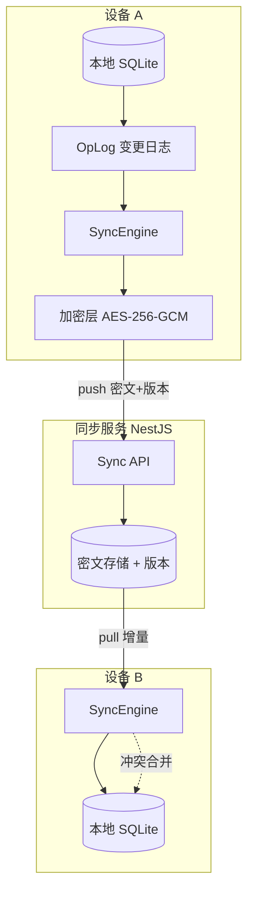
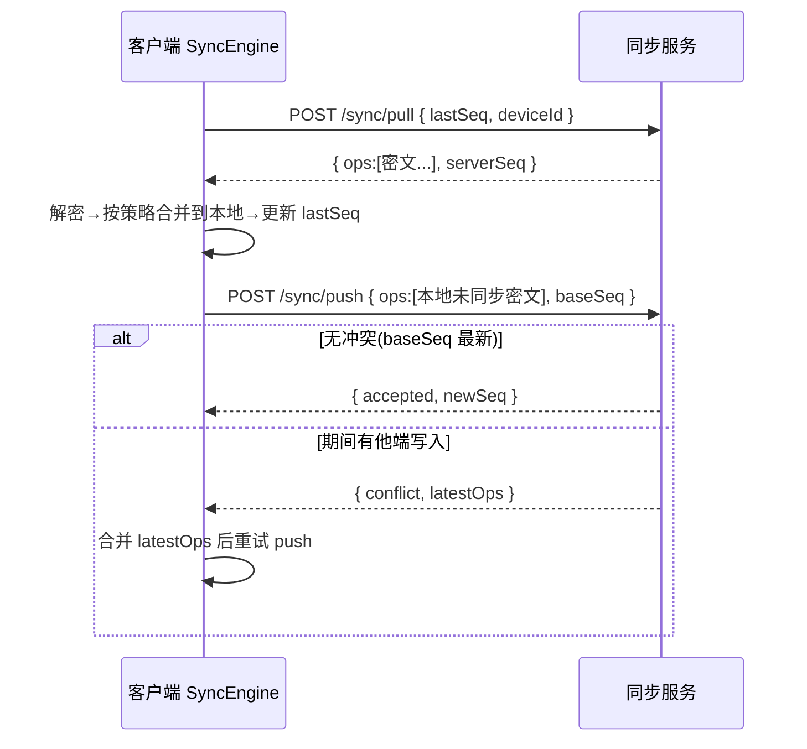
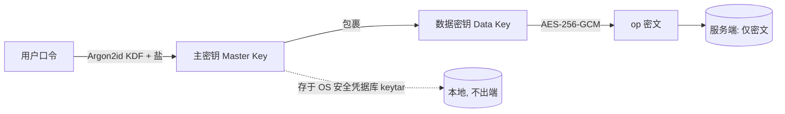

# Deskit 数据同步设计

| 项 | 内容 |
| --- | --- |
| 文档状态 | ✅ Reviewed |
| 版本 | v1.0 |
| 关联 | [架构设计](./architecture.md) · [安全设计](./security.md) · [数据模型](../03-design/data-model.md) · [PRD FR-030/031/043](../00-product/PRD.md) |

> 覆盖：用户设置同步（FR-030）、插件设置同步（FR-031）、剪贴板历史同步（FR-043），并满足隐私安全 NFR-08。

---

## 1. 设计目标与约束

| 目标 | 说明 |
| --- | --- |
| **离线优先** | 本地是真源，断网全功能可用，联网增量收敛 |
| **跨设备一致** | 任意设备改动最终一致地传播到其他设备 |
| **冲突可解** | 并发修改不丢数据、可预测合并 |
| **端到端加密** | 服务端零明文，密钥不出端（隐私红线） |
| **省流省电** | 增量同步、批量、退避，避免高频轮询 |

## 2. 同步对象与策略选择

不同数据特征不同，采用**分类策略**而非一刀切：

| 数据 | 特征 | 冲突策略 | 理由 |
| --- | --- | --- | --- |
| 用户设置（语言/主题/快捷键） | 标量 KV，低频 | **LWW + 版本向量** | 最后写入即可，无需保留历史 |
| 插件设置 | 各插件命名空间 KV | **LWW（字段级）** | 字段级合并降低冲突面 |
| 剪贴板历史 | 追加型列表，可删可收藏 | **CRDT（LWW-Element-Set）** | 多端并发增删需收敛不丢条目 |

> 决策见 [ADR-009](../01-tech-selection/tech-selection.md)。**CRDT 仅用于易冲突的集合类数据，标量用更简单的 LWW**，复杂度可控。

## 3. 同步架构

- **OpLog（操作日志）**：本地每次变更记录一条 op（实体、字段、值、时间戳、设备 id、版本号），同步以 op 为单位增量传输。
- **SyncEngine**：负责 push 本地未同步 op、pull 远端新 op、执行合并、更新本地。
- **加密层**：op 内容在离开设备前用数据密钥加密；服务端只见密文 + 路由元数据（实体类型、版本号、设备 id），**不见内容**。

## 4. 增量同步协议

### 4.1 版本游标
- 服务端为每个用户维护单调递增 `serverSeq`。
- 客户端记录上次同步到的 `lastSeq`，pull 时带上，服务端返回 `> lastSeq` 的 op。

### 4.2 同步时序

- **触发时机**：登录后首次全量、本地变更防抖（如 2s）后推送、定时拉取（如 30s，指数退避）、唤起应用时、网络恢复时。
- **批量与压缩**：op 批量打包、gzip 压缩后再加密，降低请求数与流量。

### 4.3 冲突解决细则
- **LWW 标量**：比较 `(version, deviceId)`（版本相同用 deviceId 做确定性 tiebreaker），取较大者。
- **CRDT 剪贴板（LWW-Element-Set）**：每元素带 add/remove 时间戳；同元素 add 与 remove 取时间戳较大的动作；收藏标记同理字段级 LWW。保证**任意合并顺序结果一致（收敛性）**。
- **可见性**：合并结果对用户透明展示"x 条来自其他设备"，重大冲突（如同键不同值）可在设置中查看（满足 FR-031"冲突可查看"）。

## 5. 端到端加密（E2EE）

- **密钥派生**：主密钥由用户口令经 **Argon2id**（加盐、足够内存/迭代）派生，**绝不上传**。
- **数据密钥**：随机生成 `DataKey` 用主密钥包裹存储，便于换口令时只重包裹密钥而非重加密全部数据。
- **加密算法**：**AES-256-GCM**（认证加密，防篡改），每条 op 独立 nonce。
- **密钥存储**：主密钥/数据密钥经 OS 凭据库（macOS Keychain / Windows Credential Vault，`keytar`）保存，不落明文磁盘。
- **服务端零知识**：服务端无解密能力，泄露也只得密文。元数据最小化。

## 6. 可插拔同步后端（应对开放问题）
PRD 开放问题之一：自建后端 vs 复用对象存储。设计为 **`SyncProvider` 接口**，支持多后端：

| Provider | 说明 | 适用 |
| --- | --- | --- |
| `DeskitCloudProvider` | 自建 NestJS 同步服务（默认） | 完整体验，统一账号 |
| `WebDAVProvider` | 用户自有 WebDAV/坚果云等 | 不信任第三方云、零运维 |
| `S3Provider` | 用户自有 S3/MinIO 桶 | 进阶用户 |

> 所有 Provider 之上加密层一致，**加密在 Provider 之上做**，因此任何后端都只存密文。训练营默认实现 `DeskitCloudProvider` + `WebDAVProvider` 兜底。

## 7. 性能与配额
- 剪贴板同步默认**限条数/限大小**（如最近 N 条、单条 < 1MB，大图走引用），可在设置中调整或关闭（FR-043 "可关闭/限条数"）。
- 大对象（图片）：内容存对象存储/WebDAV，op 中只放加密引用 + 哈希，避免 op 膨胀。
- 退避：失败指数退避，避免风暴；移动网络下可暂停大对象同步。

## 8. 失败与一致性保障
| 场景 | 处理 |
| --- | --- |
| 网络中断 | 本地照常写 OpLog，恢复后续传；幂等 op 防重复 |
| push 冲突 | pull-合并-重试（乐观并发） |
| 部分应用失败 | op 应用具幂等性（op id 去重），可安全重放 |
| 口令错误 | 解密 GCM 校验失败→提示口令错误，不污染本地数据 |
| 设备丢失 | 设置中可吊销设备、轮换数据密钥（重包裹） |

## 9. 隐私与合规（NFR-08）
- 数据**默认仅本地**，同步是用户显式开启 + 登录授权的可选项。
- 提供**数据导出（明文，本地）**与**云端数据删除**入口。
- 同步内容端到端加密，遥测匿名且可关闭。

## 10. 与其他模块的边界
- 加密原语、密钥管理的威胁分析见 [安全设计 §密钥与加密](./security.md)。
- 同步服务 API 契约见 [API/IPC 设计 §同步服务](../03-design/api-ipc.md)。
- OpLog、版本向量、CRDT 元数据的本地表结构见 [数据模型](../03-design/data-model.md)。
