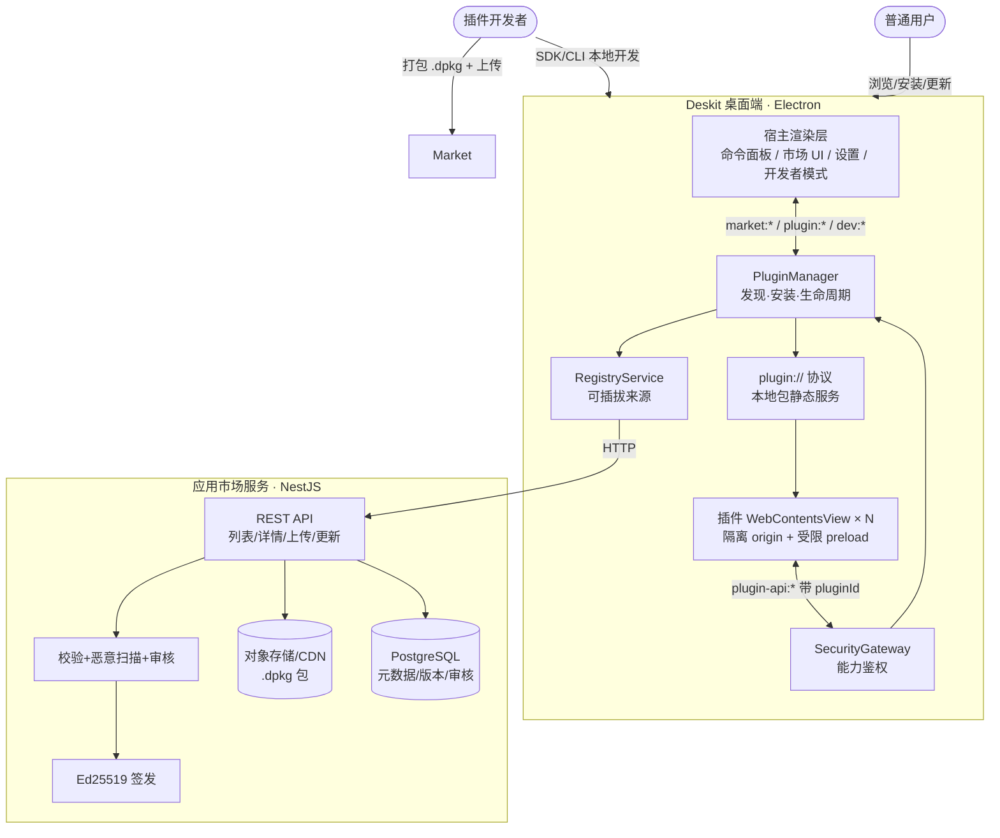
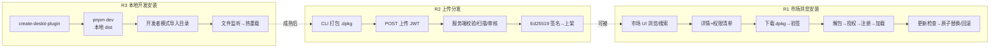
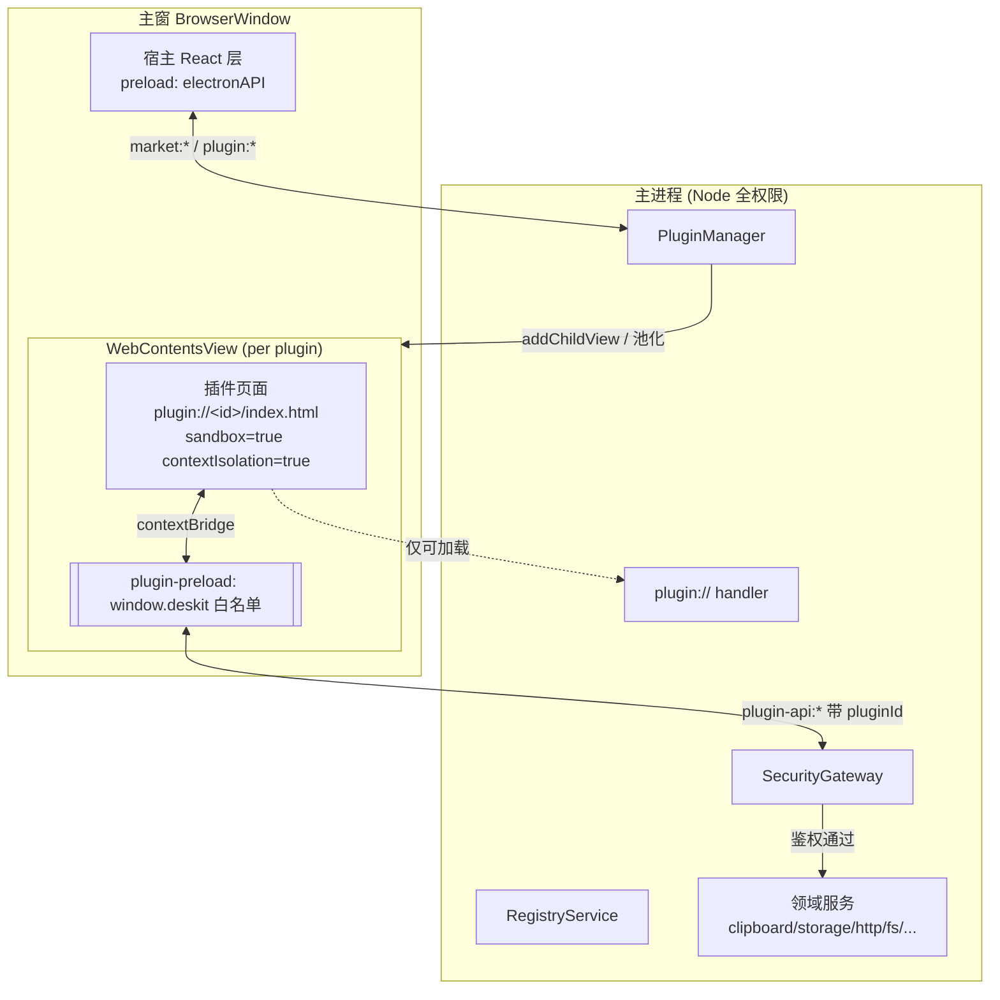
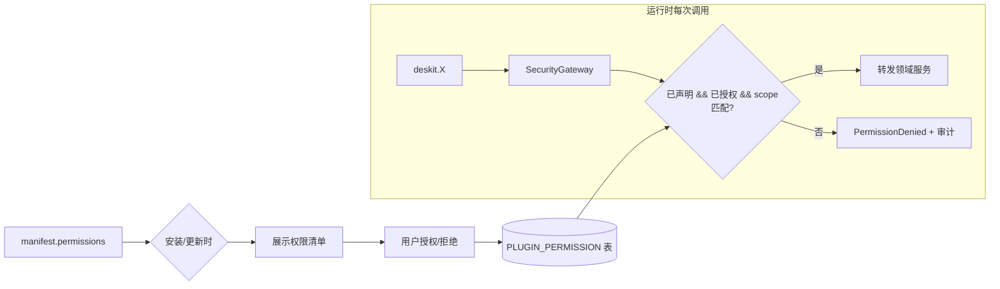
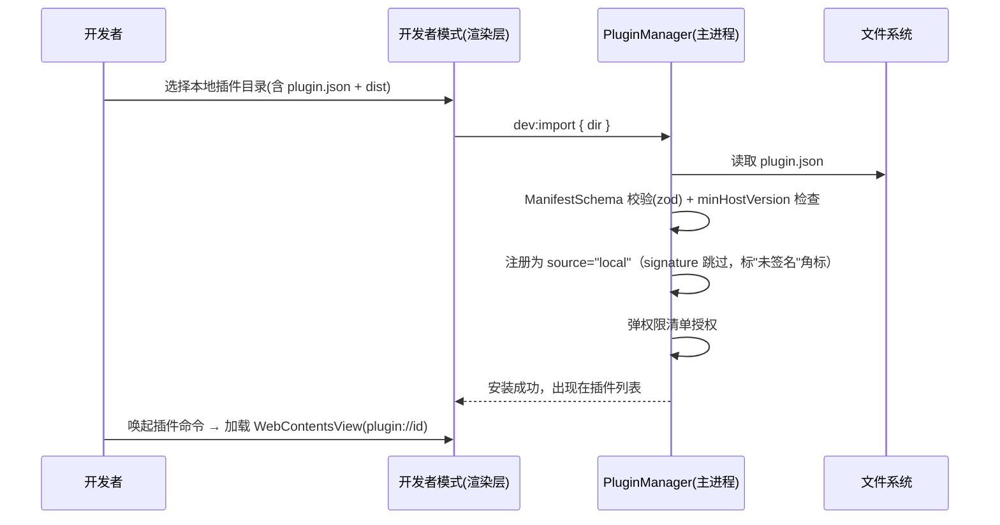
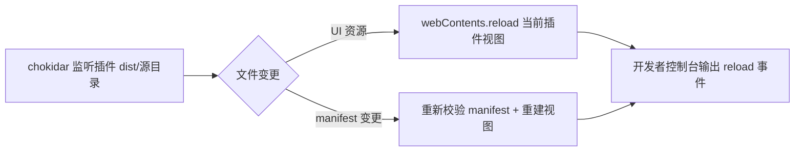
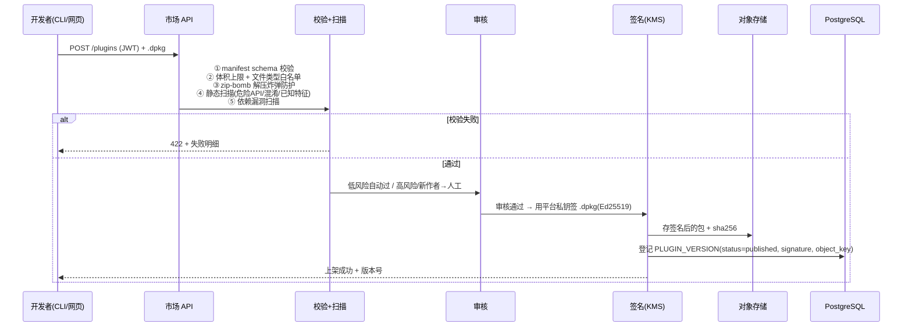
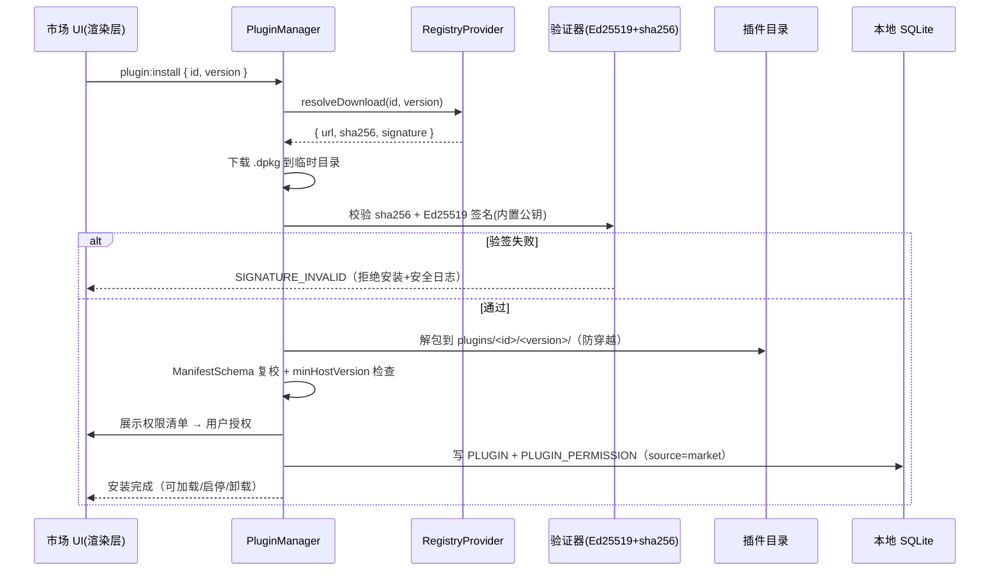
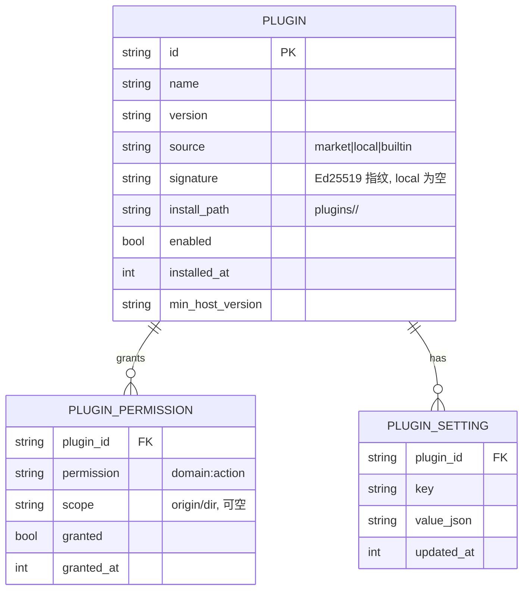
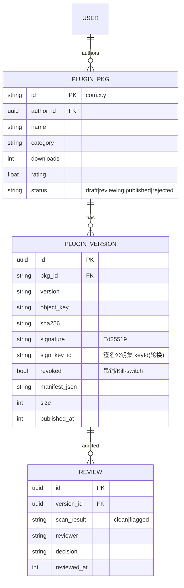

# Deskit 插件机制与应用市场架构设计书

| 项 | 内容 |
| --- | --- |
| 文档状态 | 🟡 Draft（v0.2 评审优化） |
| 版本 | v0.2 |
| 作者 | 架构组 |
| 最近更新 | 2026-05-24 |
| 需求来源 | **支持应用市场、支持用户上传/安装应用、支持用户自行开发安装本地应用** |
| 关联需求 | [PRD FR-010 ~ FR-015](../00-product/PRD.md) |
| 关联文档 | [系统架构](./architecture.md) · [插件系统总览](./plugin-system.md) · [安全设计](./security.md) · [API/IPC](../03-design/api-ipc.md) · [数据模型](../03-design/data-model.md) · [技术选型 ADR-007/008](../01-tech-selection/tech-selection.md) |
| 基座代码 | `DesKit/`（Electron 33 + electron-vite + React 19 + TS strict） |

> 本设计书是 [插件系统总览](./plugin-system.md) 的**工程级展开**，聚焦"应用市场 + 上传安装 + 本地开发安装"三条主链路，并**显式落到现有基座代码（DesKit）的改造点**，使一名工程师可据此直接实现。术语统一：本项目中"插件 / 应用 / 扩展"为同义词，包格式统一称 **`.dpkg`**。

---

## 1. 需求拆解与目标

### 1.1 三条需求 → 能力映射

| # | 原始需求 | 拆解能力 | 对应 FR | 本期定位 |
| --- | --- | --- | --- | --- |
| **R1** | 支持应用市场 | 浏览 / 搜索 / 分类 / 详情 / 评分 / 一键安装 / 启停 / 卸载；客户端内嵌市场 UI | FR-010、FR-011 | P0=本地 + mock registry；真实服务端市场=挑战 |
| **R2** | 支持用户上传、安装应用 | 开发者打包上传 → 服务端校验/扫描/审核/签名 → 上架 → 其他用户下载安装/更新 | FR-011、FR-014、FR-015 | 挑战（⭐⭐⭐ ~ ⭐⭐⭐⭐⭐） |
| **R3** | 支持用户自行开发安装本地应用 | SDK + CLI + 开发者模式（导入本地目录、热重载、独立控制台/DevTools） | FR-012、FR-013 | P0（开发安装）+ P1（文档/CLI 挑战） |

### 1.2 设计目标（与 [plugin-system §1](./plugin-system.md) 对齐）

| 目标 | 落地手段 |
| --- | --- |
| **低门槛** | 插件即 Web 应用（HTML/React/JS），与主程序同构；`create-deskit-plugin` 一键起步 |
| **强隔离** | 每插件独立 `WebContentsView` + 独立 origin；默认零权限；崩溃不波及主程序 |
| **可声明** | 能力以 manifest 声明，运行时经 `SecurityGateway` 鉴权（最小权限） |
| **可分发** | `.dpkg` 包 + Ed25519 签名 + 哈希校验，市场上传/审核/安装/更新闭环 |
| **可演进** | **Registry 可插拔**（builtin → mock JSON → 远程 HTTP），隔离强度可从 WebContentsView 升级到子进程/VM，**插件 API 协议不变** |
| **不破坏基座** | 复用 DesKit 现有安全基线、`app://` 协议范式、4-touchpoint IPC 模式，不回退任何安全配置 |

### 1.3 基座现状（约束前提）

> 读取 `DesKit/src` 后确认：基座目前为**早期脚手架**，已具备命令面板（launcher）、设置、托盘、全局快捷键，**尚无插件系统**。以下既有资产是本设计的复用基础：

| 既有资产 | 位置 | 在本设计中的复用 |
| --- | --- | --- |
| Electron 安全基线 | `src/main/index.ts`（`contextIsolation/sandbox/nodeIntegration:false/webviewTag:false` + CSP + `setWindowOpenHandler`/`will-navigate`/`will-attach-webview`） | 插件视图**强制继承**同一基线，新增 `plugin://` 协议与按插件 CSP |
| 自定义协议 + 路径穿越防护 | `src/main/protocol/resolve-static-path.ts`（`app://` scheme + `resolveStaticPath`） | 新增 `plugin://` scheme，**复用同一路径穿越防护**为插件包提供本地静态服务 |
| 4-touchpoint IPC 模式 | `ipc/*.ts`（纯函数）→ `index.ts`（`ipcMain.handle`）→ `preload/index.ts`（`contextBridge`）→ `renderer/src/lib/electron.ts`（唯一封装） | 宿主侧 `market:*` / `plugin:*` / `dev:*` 走同一模式；**插件侧另起 `window.deskit` 桥** |
| 窗口/视图工厂范式 | `src/main/search-window.ts`（窗口预热、隐藏复用、blur 自动隐藏） | `PluginHostView` 沿用"预创建 + 池化复用"思路 |
| 设置广播 | `index.ts: broadcastSettingsChanged` | 主题/语言变更广播给所有插件视图（FR-005/006 插件继承） |

---

## 2. 总体架构

### 2.1 端-云全景



### 2.2 三条主链路总览



三条链路**共用同一套底座**：包模型（§3）、运行时隔离（§4）、权限模型（§5）、本地注册表（§9）。差异只在**插件从哪来**（来源）与**信任度**（本地开发 = 开发者自负；市场 = 平台签名背书）。

---

## 3. 插件包模型

### 3.1 包结构与 `.dpkg`

```text
com.deskit.timestamp/                 # 解包后目录（以 manifest.id 命名）
├─ plugin.json                        # manifest（核心，§3.2）
├─ dist/                              # 构建产物（插件页面入口）
│  ├─ index.html
│  ├─ assets/*.js / *.css
├─ assets/icon.png
├─ locales/{zh-CN,en-US}.json         # 可选 i18n
├─ preload.js                         # 可选：插件自带 preload（仍受平台白名单约束）
└─ CHANGELOG.md
```

- **分发态**：`.dpkg` = 上述目录的 **zip 容器**（含 `manifest` + `dist`），市场签名后下发。
- **安装态**：解包到 `userData/plugins/<id>/<version>/`，由本地注册表登记。
- **本地开发态**：直接指向开发者磁盘上的源目录（不打包，见 §6）。

### 3.2 Manifest 规范（`plugin.json`，沿用 [plugin-system §3.2](./plugin-system.md)，补充字段）

```jsonc
{
  "manifestVersion": 1,                 // ★ 新增：manifest 自身版本，便于演进
  "id": "com.deskit.timestamp",         // 反向域名，全局唯一
  "name": "时间戳转换",
  "version": "1.2.0",                   // 语义化版本
  "minHostVersion": "1.0.0",            // 最低宿主版本（与 app version 比较）
  "engine": "webview",                  // ★ 运行时类型：webview | worker（演进位）
  "main": "dist/index.html",            // UI 入口（相对包根）
  "icon": "assets/icon.png",
  "description": { "zh-CN": "时间戳互转", "en-US": "Timestamp converter" },
  "commands": [                         // 注册到命令面板
    { "keyword": "ts",  "title": "时间戳转换", "mode": "view" },
    { "keyword": "now", "title": "当前时间戳", "mode": "no-view" }
  ],
  "permissions": [                      // ★ 能力清单（默认全拒，§5）
    "clipboard:read",
    "storage:plugin",
    "network:fetch=https://api.example.com"
  ],
  "i18n": "locales/",
  "author": "dave",
  "homepage": "https://...",
  "headless": "dist/headless.js",        // ★ no-view 命令的无界面入口（engine=worker，§4.6）；纯 UI 插件可省略
  "signature": null                      // 本地为空；市场签发后填入带 keyId 的签名对象（§8.2）：
                                         //   { "keyId": "deskit-2026", "alg": "ed25519", "value": "..." }
}
```

### 3.3 Manifest 校验（zod，宿主与服务端共用）

> 复用基座已引入的 `zod`（见 `package.json`）。校验逻辑放 `packages/shared`，**客户端安装时**与**服务端上传时**双端执行同一份 schema，杜绝漂移。

```ts
// packages/shared/src/plugin-manifest.ts
import { z } from "zod"

export const PermissionSchema = z.string().regex(
  /^[a-z]+:[a-z-]+(=.+)?$/,            // domain:action[=scope]
)

export const ManifestSchema = z.object({
  manifestVersion: z.literal(1),
  id: z.string().regex(/^[a-z0-9]+(\.[a-z0-9-]+)+$/),   // 反向域名
  name: z.string().min(1).max(60),
  version: z.string().regex(/^\d+\.\d+\.\d+/),
  minHostVersion: z.string(),
  engine: z.enum(["webview", "worker"]).default("webview"),
  main: z.string(),
  icon: z.string().optional(),
  description: z.record(z.string(), z.string()),
  commands: z.array(z.object({
    keyword: z.string().min(1),
    title: z.string(),
    mode: z.enum(["view", "no-view"]),
  })).default([]),
  permissions: z.array(PermissionSchema).default([]),
  i18n: z.string().optional(),
  author: z.string(),
  homepage: z.string().url().optional(),
  headless: z.string().optional(),                       // no-view 命令入口（§4.6）
  signature: z.union([                                   // 带 keyId，支持公钥轮换（§8.2）
    z.null(),
    z.object({ keyId: z.string(), alg: z.literal("ed25519"), value: z.string() }),
  ]).default(null),
})

export type PluginManifest = z.infer<typeof ManifestSchema>
```

---

## 4. 插件运行时与隔离（落到基座代码）

### 4.1 进程与视图拓扑

插件以 **`WebContentsView`** 挂载进宿主主窗（[ADR-007](../01-tech-selection/tech-selection.md)），与宿主渲染层共存但 **webContents 级隔离**：



**隔离保证（强制，继承并扩展基座 `src/main/index.ts` 基线）：**

1. 插件页面经 **`plugin://<id>/...`** 加载（§4.2），**每插件一个 origin**，天然跨源隔离；CSP **锁死全部取数指令**（`connect-src`/`img-src`/`media-src`/`font-src`/`style-src`/`prefetch-src` 等）到 `'self' data:` + 声明的网络 scope——只锁 `connect-src` 挡不住经 ``/`sendBeacon` 的隐蔽外泄（详见 §4.7）。
2. `sandbox:true` + `contextIsolation:true` + `nodeIntegration:false`：插件页面**无 Node、无 `require`**。
3. 仅经 **专用 plugin-preload** 暴露 `window.deskit.*` 白名单，**不暴露 `ipcRenderer` 原始对象**（与宿主 `electronAPI` 同原则）。
4. 每个 `plugin-api:*` IPC 由主进程在加载时建立的 **`webContentsId ↔ pluginId`** 映射反查身份，**客户端无法伪造 pluginId**（抗 STRIDE-Spoofing，见 [security §3 T1](./security.md)）。
5. 复用基座 `attachWindowSecurity`：`setWindowOpenHandler`/`will-navigate` 拦截外部导航与 `window.open`，外链走系统浏览器。

### 4.2 `plugin://` 自定义协议（复用基座路径穿越防护）

基座已用 `app://` 服务宿主渲染产物，并有路径穿越安全解析器 `resolveStaticPath`。**插件包静态资源新增 `plugin://` scheme**，复用同一防护：

```ts
// src/main/protocol/plugin-protocol.ts（新增，范式取自 index.ts:registerStaticProtocol）
import { net, protocol } from "electron"
import { pathToFileURL } from "node:url"
import { getContentType, resolveStaticPath } from "./resolve-static-path"

// 与 app:// 一样在 app ready 前注册为 standard + secure（origin 行为类 https）
// 在 protocol.registerSchemesAsPrivileged([...]) 中追加：
//   { scheme: "plugin", privileges: { standard: true, secure: true, supportFetchAPI: true, stream: true } }

export function registerPluginProtocol(resolveRoot: (pluginId: string) => string | null): void {
  protocol.handle("plugin", async (request) => {
    // URL 形如 plugin://com.deskit.timestamp/index.html
    const url = new URL(request.url)
    const pluginId = url.hostname                 // host = pluginId（每插件独立 origin）
    const root = resolveRoot(pluginId)            // 已安装包的 dist 目录
    if (!root) return new Response("Not Found", { status: 404 })

    const resolved = resolveStaticPath(url.pathname, root)   // ★ 复用路径穿越防护
    if (resolved.kind === "forbidden") return new Response("Forbidden", { status: 403 })

    const fileUrl = pathToFileURL(resolved.filePath).toString()
    const res = await net.fetch(fileUrl, { bypassCustomProtocolHandlers: true })
    if (!res.ok) return res
    const headers = new Headers(res.headers)
    headers.set("content-type", getContentType(resolved.filePath))
    return new Response(res.body, { status: res.status, headers })
  })
}
```

> 设计要点：`hostname` 作为 `pluginId` ⇒ `plugin://a.b.c` 与 `plugin://x.y.z` 是**不同 origin**，浏览器同源策略自动隔离插件间 DOM/存储/网络，无需额外措施。

### 4.3 插件视图工厂 `PluginHostView`（范式取自 `search-window.ts`）

```ts
// src/main/plugins/plugin-host-view.ts（新增）
import { WebContentsView } from "electron"
import * as path from "node:path"

export interface PluginViewHandle {
  pluginId: string
  view: WebContentsView
  webContentsId: number
}

export function createPluginView(pluginId: string): PluginViewHandle {
  const view = new WebContentsView({
    webPreferences: {
      preload: path.join(__dirname, "../preload/plugin.js"),   // 专用插件 preload
      contextIsolation: true,
      nodeIntegration: false,
      sandbox: true,
      webviewTag: false,
      // 注：每插件独立 session 分区，存储/cookie/cache 互不可见
      partition: `persist:plugin-${pluginId}`,
    },
  })
  void view.webContents.loadURL(`plugin://${pluginId}/index.html`)
  return { pluginId, view, webContentsId: view.webContents.id }
}
```

- **挂载**：`mainWindow.contentView.addChildView(handle.view)`，由 `WindowManager` 控制可见区域（命令面板下方/独立窗）。
- **池化（LRU）**：常用插件视图保留内存池，冷插件 `Suspended` 时 `removeChildView` 并释放；再次唤起复用——与基座 `ensureSearchWindow` 的"预创建+隐藏复用"同理。
- **主题继承**：`broadcastSettingsChanged` 扩展为向所有插件 `webContents.send("theme:changed", tokens)`，插件 preload 转抛 `onThemeChange`（FR-005/006）。
- **i18n 隔离**：插件自带语言包以 `pluginId` 为 i18next **命名空间**合并进宿主，避免与宿主或其他插件的 key 撞车。

### 4.4 受控插件 API 桥（`window.deskit`）

插件 preload 与宿主 preload **并存但独立**：宿主用 `electronAPI`（既有），插件用 `deskit`（新增），后者每个调用都映射为**带身份的受控 IPC**：

```ts
// src/preload/plugin.ts（新增，范式取自现有 src/preload/index.ts）
import { contextBridge, ipcRenderer } from "electron"

// 身份的唯一可信来源是主进程侧 `event.sender.id` 反查（§4.5）——preload/渲染层
// 无需也不可自报 pluginId。任何注入参数仅用于「展示」，绝不参与鉴权决策。
const deskit = {
  version: 1,                                                  // ★ 能力协商：插件可 feature-detect（见下方注）
  showToast: (o: { type: string, message: string }) => ipcRenderer.invoke("plugin-api:toast", o),
  setSearchResults: (items: unknown[]) => ipcRenderer.invoke("plugin-api:results:set", { items }),
  closeWindow: () => ipcRenderer.invoke("plugin-api:close"),
  clipboard: {
    read: () => ipcRenderer.invoke("plugin-api:clipboard:read"),
    write: (item: unknown) => ipcRenderer.invoke("plugin-api:clipboard:write", item),
  },
  storage: {
    get: (k: string) => ipcRenderer.invoke("plugin-api:storage:get", { key: k }),
    set: (k: string, v: unknown) => ipcRenderer.invoke("plugin-api:storage:set", { key: k, value: v }),
  },
  // ★ 优先用渲染层原生 fetch（受 CSP connect-src 强制）；deskit.fetch 仅在需绕过 CORS 时用，
  //   且主进程侧按「解析后 IP」allowlist + 禁私网/环回，防 SSRF（§4.7）
  fetch: (url: string, init?: unknown) => ipcRenderer.invoke("plugin-api:fetch", { url, init }),
  fs: { readText: (p: string) => ipcRenderer.invoke("plugin-api:fs:readText", { path: p }) },
  i18n: { t: (k: string) => ipcRenderer.invoke("plugin-api:i18n:t", { key: k }) },
  onThemeChange: (cb: (t: unknown) => void) => {
    const l = (_: unknown, t: unknown): void => cb(t)
    ipcRenderer.on("theme:changed", l)
    return () => ipcRenderer.removeListener("theme:changed", l)
  },
} as const

contextBridge.exposeInMainWorld("deskit", deskit)
export type DeskitAPI = typeof deskit
```

> **能力协商（兼容性）**：`deskit.version` 暴露插件 API 版本，插件据此 feature-detect；网关对**未知 channel** 返回 `ErrorCode` 而非抛异常，避免"插件调到宿主没有的方法直接崩"。`minHostVersion` 只做加载下限，运行期仍以 feature detection 为准。

### 4.5 SecurityGateway（鉴权枢纽）

所有 `plugin-api:*` 必须先过网关，**绝不直接 `ipcMain.handle` 到领域服务**：

```ts
// src/main/security/security-gateway.ts（新增）
import { ipcMain } from "electron"

export class SecurityGateway {
  // 加载插件视图时登记，卸载时清除。身份的唯一可信来源。
  private idByWc = new Map<number, string>()        // webContentsId -> pluginId
  private rateLimiter = new TokenBucketPerPlugin()  // ★ 每插件 plugin-api:* 限流（§4.7）

  bind(webContentsId: number, pluginId: string): void { this.idByWc.set(webContentsId, pluginId) }
  unbind(webContentsId: number): void { this.idByWc.delete(webContentsId) }

  /** 注册一个受控通道：声明所需权限 + 业务处理器。 */
  handle<T>(channel: string, required: string, fn: (pluginId: string, payload: unknown) => Promise<T>): void {
    ipcMain.handle(channel, async (event, payload) => {
      const pluginId = this.idByWc.get(event.sender.id)          // ★ 反查，不信任入参
      if (!pluginId) return err("PERMISSION_DENIED")
      if (!this.rateLimiter.allow(pluginId, channel)) {          // ★ 令牌桶限流，防刷 clipboard/fetch
        audit(pluginId, channel, "rate-limited")
        return err("RATE_LIMITED")
      }
      if (!this.isGranted(pluginId, required, payload)) {        // 声明 && 用户授权 && scope 匹配
        audit(pluginId, channel, "denied")                       // 审计（抗抵赖）
        return err("PERMISSION_DENIED")
      }
      return ok(await fn(pluginId, payload))
    })
  }

  private isGranted(pluginId: string, required: string, payload: unknown): boolean { /* 查授权表 + scope 校验 */ }
}
```

> 与基座衔接：网关注册发生在 `index.ts` 的 `registerIpc()` 旁新增的 `registerPluginApi(sg, services)`；宿主侧 `market:*`/`plugin:*` 仍走原 4-touchpoint，不经网关（宿主是半信任域）。

### 4.6 双运行时：UI 视图 vs 无界面命令

`commands[].mode` 区分两类执行体，**绝不可让无界面命令也各起一个 `WebContentsView`**（每个 = 一个 Chromium 渲染进程，几十个插件即击穿 NFR-01「空闲内存 < 200MB」）：

| 运行时 | 触发 | 承载 | 资源 |
| --- | --- | --- | --- |
| **UI 视图**（`engine=webview`, `mode=view`） | 打开插件页面 | `WebContentsView`（§4.3） | 重，进 LRU 池 |
| **无界面命令**（`engine=worker`, `mode=no-view`） | 命令面板回车直接出结果 | `utilityProcess` / `Worker` / Node `vm` 执行 `headless.js` | 轻，按需起停，可设 CPU/内存配额 |

- 无界面命令在隔离运行时执行后，经 `plugin-api:results:set` 把结果回填命令面板，**全程不挂视图**。
- 该分层正是 [plugin-system §4.2](./plugin-system.md)「不可信插件子进程/VM 隔离」演进路线的落点：高危/纯逻辑插件天然下沉到隔离进程，`window.deskit` 协议不变。

### 4.7 网络与数据外泄信道防护（反 SSRF + CSP 收口）

插件网络是数据外泄与服务端攻击的主通道，采取**双层 + 收口**：

1. **首选渲染层原生 `fetch`**：`plugin://` 是独立 origin，插件直接 `fetch()` 由浏览器 **CSP `connect-src` 强制**，无主进程参与，**无 SSRF 面**。
2. **`deskit.fetch` 仅用于绕过 CORS**：确需访问无 CORS 头的 API 时才走主进程代理，且主进程侧必须：
   - 按 **解析后的 IP** 做 allowlist（不只比对 hostname，防 DNS rebinding）；
   - **禁私网/环回/链路本地段**（`127/8`、`10/8`、`172.16/12`、`192.168/16`、`169.254/16`、`::1` 等），堵住打内网与云元数据 `169.254.169.254`；
   - **不跟随跨源重定向**到未声明 origin；剥离 ambient 凭据。
3. **CSP 锁全部取数指令**（见 §4.1）：`connect-src` 之外，`img-src`/`media-src`/`font-src`/`style-src`/`prefetch-src` 一并收敛，封死 ``、`sendBeacon`、字体/CSS 等隐蔽外泄信道。
4. **每插件 IPC 令牌桶限流**（§4.5）：防止插件高频刷 `clipboard:read`/`fetch` 做批量抓取或拖垮主进程。
5. **渲染进程看门狗**：监控插件视图内存/CPU 与无响应（`render-process-gone`/无响应回收），异常即回收并提示——**资源配额自 v1 起即生效，不推迟到 v1.x**。

---

## 5. 能力与权限模型（最小权限）

沿用 [plugin-system §3.3](./plugin-system.md) 与 [security §5](./security.md)，能力以 `domain:action[=scope]` 表达，**默认全部拒绝**：

| 权限 | 含义 | 风险 | 授权时机 | scope 示例 |
| --- | --- | --- | --- | --- |
| `storage:plugin` | 插件私有存储（命名空间隔离） | 低 | 默认允许 | — |
| `clipboard:read` / `clipboard:write` | 读/写剪贴板 | 中 | 安装提示 + 首次使用确认 | — |
| `network:fetch=<origin>` | 仅访问声明的源 | 高 | 安装提示，按 origin 限制 | `=https://api.x.com` |
| `fs:read=<dir>` / `fs:write=<dir>` | 受限目录读写 | 高 | 运行时弹窗授权 | `=~/Downloads` |
| `notification` | 系统通知 | 低 | 默认允许 | — |
| `shell:open` | 打开 URL/文件（不可执行命令） | 中 | 确认 | — |
| `clipboard:watch` | 监听剪贴板变化 | 高 | 显式授权 | — |



**红线**：绝不向插件提供 `child_process` / 任意 `fs` / 任意 `net` 直通。所有能力经网关代理与 scope 校验。**高危权限**（`fs:write`、`clipboard:watch`、更新时新增权限）强制二次确认，防"更新即提权"。

---

## 6. R3：本地开发安装（FR-012/013）

> 这是**生态的起点**：开发者先在本地把插件写好、调通，再考虑上传。P0 必做。

### 6.1 开发者体验三件套

| 组件 | 形态 | 作用 |
| --- | --- | --- |
| `packages/plugin-sdk` | npm 包 | 导出 `DeskitAPI` 的 **TS 类型** + 运行时桩（浏览器内 mock，便于纯 Web 调试） |
| `create-deskit-plugin` | CLI（`pnpm create deskit-plugin`） | 生成模板：React + manifest + vite 构建脚本 + 示例命令 |
| 开发者模式面板 | 宿主渲染层一页 | 导入本地目录、查看加载状态/权限/实时日志、打开插件 DevTools、热重载开关 |

### 6.2 本地安装流程



- **来源标记**：本地插件 `source="local"`、`signature=null`，UI 显著标注"**开发中 / 未签名**"，与市场签名插件区分（信任边界清晰）。
- **plugin:// 根解析**：`resolveRoot(pluginId)` 对 local 插件直接返回开发者磁盘上的 `dist` 目录（dev 模式可指向 vite dev server，见下）。

### 6.3 热重载（HMR）



- 主进程用 `chokidar` 监听 local 插件目录；变更去抖后 `view.webContents.reload()`。
- **更佳体验（挑战）**：local 插件 `main` 指向插件自己的 `vite` dev server（`http://localhost:51xx`），由宿主以受限 webPreferences 加载——此时 HMR 由插件侧 Vite 提供，宿主只负责刷新。需放宽该插件视图 CSP 的 `connect-src` 至 dev server。
- **硬门禁（安全红线）**：加载 `http://localhost` 入口与放宽 CSP **只在 `source==='local' && !app.isPackaged` 下成立**；打包产物中任何插件（含市场插件）声明 localhost/远程入口一律拒绝加载，杜绝市场插件借 dev 通道越权。
- **错误隔离**：插件抛错经 `webContents` 的 `console-message` / `render-process-gone` 捕获，输出到**插件独立控制台**，不冒泡污染主程序（FR-012 验收）。

### 6.4 开发者文档站（FR-013，复用基座 `docs/` Fumadocs）

基座已有独立 `docs/`（Fumadocs + Next.js workspace）。开发者文档直接在其中新增章节：**Hello-World、`window.deskit` API 参考、权限说明、打包发布指南**，对标 Raycast 文档质量。

---

## 7. R2：用户上传应用（FR-011 开发者侧 + FR-015 服务端防滥用）

### 7.1 服务端架构（[ADR-008](../01-tech-selection/tech-selection.md)：NestJS + PG + 对象存储 + Ed25519）

```mermaid
graph LR
  subgraph Server[市场服务 NestJS]
    Auth[AuthModule<br/>OAuth2/OIDC + JWT + RBAC]
    Plugin[PluginModule<br/>上传/版本/列表/详情]
    Review[ReviewModule<br/>静态扫描+人工审核]
    Sign[SignModule<br/>Ed25519 签发(KMS私钥)]
    Rate[限流/配额/WAF 中间件]
  end
  ObjStore[(对象存储/CDN)]
  DB[(PostgreSQL + Prisma)]
  Plugin --> DB
  Plugin --> ObjStore
  Review --> DB
  Sign --> ObjStore
  Auth --> DB
```

### 7.2 上传 → 上架流水线



**关键防滥用措施（直接落 [security §7](./security.md)，应对"恶意插件攻击服务器"）：**

| 措施 | 说明 |
| --- | --- |
| 鉴权 + RBAC | 上传/发版需登录，角色 `developer`；操作写审计日志（who/when/what） |
| 速率限制 + 配额 | 按 IP/用户/接口令牌桶限流，`429 + Retry-After`；单作者包数/体积配额 |
| 上传校验 | manifest schema、体积上限、文件类型白名单、**zip-bomb 防护**、解包路径穿越防护 |
| 恶意扫描（右尺寸） | 沙箱已封死 Node，扫描重点**不是**"危险 API"，而是**已知恶意特征/坏包指纹 + 依赖 CVE + 可疑外联域名**，并要求随包提交 source map 以便审核可读。真正的数据外泄属"已授权能力内滥用"，由权限 + CSP + 限流（§4.7）兜底，而非代码扫描 |
| 双轨审核 | 低风险自动通过，高风险 / 新作者 / 新增高危权限 → 人工复核 |
| 签名签发 | 审核通过后平台 **Ed25519 私钥（KMS/HSM 保管）** 签名；客户端内置公钥验签 |
| 输入校验 | 所有 DTO `class-validator`；Prisma 参数化查询防 SQLi |

### 7.3 客户端打包（CLI）

```bash
deskit-plugin build      # vite build → dist/
deskit-plugin pack       # 校验 manifest → 产出 com.x.y-1.2.0.dpkg（zip）
deskit-plugin publish    # 读取本地登录态 → POST /plugins → 轮询审核状态
```

---

## 8. R1：应用市场浏览与安装（FR-010/011 + 更新 FR-014）

### 8.1 Registry 可插拔抽象（P0 落地关键）

PRD 将"P0 = 本地加载 + 内置列表 + **mock registry**，真实服务端市场 = 挑战"。为让 P0 与挑战**同一套 UI/安装流程**，定义 `RegistryProvider` 接口，运行时按配置注入实现：

```ts
// src/main/plugins/registry/registry-provider.ts（新增）
export interface RegistryProvider {
  readonly kind: "builtin" | "mock" | "remote"
  list(q: MarketQuery): Promise<Paginated<PluginMeta>>
  detail(id: string): Promise<PluginDetail>
  /** 返回包的可获取地址：本地路径 或 临时签名 URL */
  resolveDownload(id: string, version: string): Promise<{ url: string, sha256: string, signature: string }>
  checkUpdates(installed: InstalledRef[]): Promise<UpdateInfo[]>
}
```

| 实现 | 数据来源 | 用途 | 阶段 |
| --- | --- | --- | --- |
| `BuiltinRegistry` | 随包内置 JSON + 官方插件 | 离线可用的内置列表 | P0 |
| `MockRegistry` | 本地/打包内 `registry.mock.json` + 本地 `.dpkg` 样例 | **模拟远程市场**（浏览/详情/安装全链路真实跑通） | P0 |
| `RemoteRegistry` | HTTP 调 NestJS（§7.1） | 真实市场 | 挑战 |

> 价值：**安装/验签/注册/加载/更新**这套核心逻辑只写一次，对三种来源完全一致；从 mock 切到真实市场只是替换 Provider 与配置，不改 UI、不改安装管线。

### 8.2 安装流程（下载 → 验签 → 解包 → 授权 → 注册 → 加载）



- **签名绑定整包**：`signature = Ed25519_sign(sha256(规范化整包，含 manifest))`，且**展示给用户的权限取自被签名覆盖的 manifest**——manifest 不可在签名后被替换，保证"展示 = 实际"。
- **公钥集 + 轮换**：客户端内置**一组**受信公钥，按 `signature.keyId` 选择验签；私钥泄露/到期可平滑轮换，老客户端仍能验旧包。
- **防降级（anti-rollback）**：记录每插件**已安装过的最高版本**，拒绝安装/"更新"到更低版本（即便其签名合法），防止重放有已知漏洞的旧版本。
- **吊销 / Kill-switch**：客户端定期拉取**吊销列表**（按 `id@version` 或泄露的 `keyId`），命中即禁用并提示卸载——应对"上架后才发现恶意"，弥补"仅靠上架前审核"的时间窗。
- **本地 / mock 包**：`BuiltinRegistry` 官方包用平台公钥验签；`local` 开发包 `signature=null`，走"未签名（仅本地，§6.2 硬门禁）"路径；mock 仅供测试，**永不出现在 remote 生产路径**。
- **解包安全**：复用 §4.2 的路径穿越防护思想，逐条目校验解压目标在目录内（防 zip-slip）。

### 8.3 市场 UI（宿主渲染层，复用既有 shadcn/ui）

基座已内置 57 个 shadcn/ui 基元。市场 UI 直接复用：`command`（搜索）、`card`/`badge`（列表项/分类）、`dialog`（权限清单确认）、`tabs`（分类/已安装/更新）、`progress`（下载进度）、`alert-dialog`（卸载确认）。新增渲染页：`src/renderer/src/components/pages/market-page.tsx`、`plugin-detail.tsx`、`developer-mode-page.tsx`。

### 8.4 更新（FR-014，⭐⭐⭐⭐）

```mermaid
flowchart LR
  A[启动/定时检查] --> B{有新版本?}
  B -->|否| Z[结束]
  B -->|是| C[拉变更日志 + 权限差异]
  C --> D{新增高危权限?}
  D -->|是| E[强制二次授权]
  D -->|否| F[后台下载新包]
  E --> F --> G[验签+sha256+manifest]
  G --> H[解包到 plugins/id/新版本/(临时)]
  H --> I{加载自检通过?}
  I -->|是| J[rename/指针切换 current → 新版本; 记录最高版本]
  I -->|否| K[回滚保留旧版本 + 上报]
```

- **原子性**：新版本解包到 `plugins/<id>/<newVersion>/`，校验通过后用**「指针文件 / 同卷目录 rename」切换 `current`**，零中断；失败保留旧版本。⚠️ **不用符号链接**——Windows 建符号链接需管理员/开发者模式权限，`current.json` 指针或同卷 rename（原子）更可移植。
- **增量更新**：包结构支持时按文件 diff 下载减小包体（NFR-09），否则全量。
- **权限差异**：更新引入新权限必须重新授权，防"更新即提权"（[security §5](./security.md)）。

---

## 9. 数据模型（本地 + 服务端）

### 9.1 本地（SQLite + Drizzle，[data-model §2](../03-design/data-model.md)）



- `PLUGIN_SETTING` 即 `storage:plugin` 落地，**按 `plugin_id` 命名空间隔离**，插件间数据互不可见。
- **卸载彻底清理**：除级联删 `PLUGIN_*` 表与包目录外，必须 `session.fromPartition('persist:plugin-<id>').clearStorageData()` 清掉插件视图分区里的 localStorage/IndexedDB/cookie/cache——否则同名插件重装会残留旧数据。
- 配置项（已安装列表缓存、市场来源选择、各插件已装最高版本）走 `electron-store`（基座现用 settings 文件范式）。

### 9.2 服务端（PostgreSQL + Prisma，[data-model §4](../03-design/data-model.md)）



---

## 10. 接口契约（IPC / 插件 API / HTTP）

> 全部以 `packages/ipc-contract` + `packages/shared` 类型为唯一事实源（[api-ipc §1](../03-design/api-ipc.md)）。

### 10.1 宿主 IPC（4-touchpoint，经基座既有模式）

| Channel | 方向 | 用途 | 链路 |
| --- | --- | --- | --- |
| `market:list` / `market:detail` | R→M | 市场浏览/详情 | R1 |
| `plugin:install` / `plugin:uninstall` | R→M | 安装/卸载 | R1/R2 |
| `plugin:list` / `plugin:setEnabled` | R→M | 已装列表/启停 | R1 |
| `plugin:checkUpdates` / `plugin:update` | R→M | 更新检查/执行 | FR-014 |
| `dev:import` / `dev:reload` / `dev:remove` | R→M | 开发者模式导入/热重载/移除 | R3 |
| `dev:logs` | M→R | 插件控制台日志推送 | R3 |
| `plugin:reloaded` / `plugin:installed` | M→R | 状态广播 | 通用 |

### 10.2 插件 API（plugin↔host，经 SecurityGateway）

| Channel | 所需权限 | 说明 |
| --- | --- | --- |
| `plugin-api:clipboard:read` / `:write` | `clipboard:read`/`write` | 剪贴板 |
| `plugin-api:storage:get` / `:set` | `storage:plugin` | 私有存储 |
| `plugin-api:fetch` | `network:fetch=<origin>` | **仅绕过 CORS 时用**；按解析 IP allowlist + 禁私网，防 SSRF（§4.7）。常规请求走渲染层原生 `fetch`（CSP 强制） |
| `plugin-api:fs:readText` | `fs:read=<dir>` | 受 scope 限制读取 |
| `plugin-api:results:set` / `:toast` / `:close` | 无（UI 能力） | 结果回填/提示/关闭 |

### 10.3 服务端 HTTP（[api-ipc §4.1](../03-design/api-ipc.md)）

| 方法 | 路径 | 说明 | 鉴权 |
| --- | --- | --- | --- |
| GET | `/api/v1/plugins` | 列表（分页/分类/关键字/排序） | 否 |
| GET | `/api/v1/plugins/:id` | 详情（版本/权限/评分/变更日志） | 否 |
| GET | `/api/v1/plugins/:id/versions/:v/download` | 临时签名下载 URL | 否 |
| POST | `/api/v1/plugins` | 上传新插件 | 是(developer) |
| POST | `/api/v1/plugins/:id/versions` | 发布新版本 | 是(author) |
| GET | `/api/v1/plugins/updates?installed=...` | 批量检查更新 | 否 |

---

## 11. 对基座（DesKit）的改造点清单

> 明确"动哪些文件、加哪些目录"，使设计可直接施工，且**不回退任何现有安全配置**。

### 11.1 新增目录/文件

```text
src/main/
├─ plugins/
│  ├─ plugin-manager.ts            # 发现/安装/卸载/启停/更新（领域核心）
│  ├─ plugin-host-view.ts          # WebContentsView 工厂 + 池化（§4.3）
│  ├─ installer.ts                 # 下载/验签/解包(防zip-slip)/原子替换
│  ├─ verifier.ts                  # Ed25519 + sha256 校验
│  ├─ dev-watcher.ts               # chokidar 热重载（§6.3）
│  └─ registry/
│     ├─ registry-provider.ts      # 接口（§8.1）
│     ├─ builtin-registry.ts
│     ├─ mock-registry.ts          # P0：registry.mock.json
│     └─ remote-registry.ts        # 挑战：HTTP
├─ security/
│  └─ security-gateway.ts          # 能力鉴权枢纽（§4.5）
├─ protocol/
│  └─ plugin-protocol.ts           # plugin:// 协议（§4.2，复用 resolve-static-path）
└─ ipc/
   ├─ market-service.ts            # market:* 业务（纯函数，可测）
   └─ plugin-service.ts            # plugin:* / dev:* 业务

src/preload/
└─ plugin.ts                       # 插件专用 window.deskit 桥（§4.4）

src/renderer/src/components/pages/
├─ market-page.tsx
├─ plugin-detail.tsx
└─ developer-mode-page.tsx

packages/
├─ shared/src/plugin-manifest.ts   # zod schema（双端共用，§3.3）
├─ plugin-sdk/                     # 类型 + 运行时桩（R3）
└─ ipc-contract/                   # market:*/plugin:*/plugin-api:* 契约
```

### 11.2 改动既有文件

| 文件 | 改动 |
| --- | --- |
| `src/main/index.ts` | ① `registerSchemesAsPrivileged` 追加 `plugin` scheme；② app ready 后 `registerPluginProtocol(...)`；③ 新增 `registerMarketIpc()` / `registerPluginApi(sg, services)`；④ `broadcastSettingsChanged` 扩展为同时广播给插件视图 |
| `src/preload/index.ts` + `index.d.ts` | 宿主 `electronAPI` 追加 `market.*` / `plugin.*` / `dev.*` 方法与类型 |
| `src/renderer/src/lib/electron.ts` | 新增 `listMarket/installPlugin/...` 等类型安全封装（**仍是唯一调用 `window.electronAPI` 的模块**） |
| `electron.vite.config.ts` | preload 增加 `plugin.ts` 入口（多 preload 产物） |
| `package.json` | 新增依赖：`chokidar`（热重载）、`@noble/ed25519` 或 `tweetnacl`（验签）、`better-sqlite3` + `drizzle-orm`（注册表持久化，[ADR-006](../01-tech-selection/tech-selection.md)） |
| `docs/`（Fumadocs） | 新增开发者文档章节（R3，FR-013） |

### 11.3 安全基线对齐（强制不回退）

- 插件 `WebContentsView` 的 `webPreferences` **与基座主窗一致**：`contextIsolation:true` + `sandbox:true` + `nodeIntegration:false` + `webviewTag:false`。
- 复用基座 `attachWindowSecurity` 的 `setWindowOpenHandler`/`will-navigate`/`will-attach-webview` 三道拦截。
- CSP：宿主沿用基座 `PROD_CSP`；插件视图按 manifest 的 `network:fetch` scope **逐插件生成 CSP**，**`connect-src`/`img-src`/`media-src`/`font-src`/`style-src`/`prefetch-src` 全部收敛**到 `'self' data:` + 声明 origin（防隐蔽外泄，§4.7），经 `onHeadersReceived` 按 `webContentsId` 区分注入。

---

## 12. 关键失败与边界场景

| 场景 | 处理 |
| --- | --- |
| 插件崩溃/死循环 | 视图独立；`render-process-gone` + 无响应看门狗回收（§4.7）；**每插件 IPC 限流 + 资源配额自 v1 生效** |
| 验签失败 | 拒绝安装 + 安全日志（`SIGNATURE_INVALID`） |
| 宿主版本不满足 `minHostVersion` | 拒绝加载并提示升级 |
| 权限被拒 | API 返回 `PERMISSION_DENIED`，插件应优雅降级 |
| 网络越权 / SSRF / 隐蔽外泄 | CSP 锁全部取数指令 + `deskit.fetch` 解析 IP allowlist 禁私网 + Gateway scope，三层拦截（§4.7） |
| zip-slip / zip-bomb | 解包逐条目路径校验 + 解压体积/比例上限 |
| 本地插件未签名 | 允许安装但 UI 显著标注"未签名/开发中"，与市场插件信任隔离 |
| 更新加载失败 | 原子回滚（指针/rename，非符号链接）到旧版本 + 上报 |
| 版本降级重放 | 拒绝安装低于已装最高版本的包（即便签名合法，§8.2） |
| 上架后发现恶意 | 吊销列表命中即禁用并提示卸载（Kill-switch，§8.2） |
| 卸载残留 | 清 `PLUGIN_*` 表 + 包目录 + session 分区存储（§9.1） |
| mock → 真实市场切换 | 仅替换 `RegistryProvider` 实现，安装管线不变 |

---

## 13. 落地里程碑（对齐 [PRD §7](../00-product/PRD.md) 与 [roadmap](../04-implementation/roadmap.md)）

| 阶段 | 范围 | 验收 |
| --- | --- | --- |
| **M2-a（P0 内核）** | `plugin://` 协议 + `PluginHostView` + plugin-preload + SecurityGateway + 本地注册表；**本地开发安装 + 热重载**（R3） | 导入本地目录 → 授权 → 加载运行 → 改文件即热重载 |
| **M2-b（P0 市场壳）** | `RegistryProvider` 抽象 + `BuiltinRegistry` + `MockRegistry` + 市场 UI（列表/详情/权限清单/安装/启停/卸载） | 从 mock 市场"浏览→安装→运行→卸载"全链路跑通（R1 基础） |
| **M4-挑战-1** | NestJS 服务端：列表/详情/下载 URL + 客户端 `RemoteRegistry` | 真实远程浏览 + 安装（R1 真实化） |
| **M4-挑战-2** | 上传流水线：上传 API + 校验/扫描/审核 + Ed25519 签发 + 客户端验签 | 开发者上传 → 审核 → 上架 → 他人安装（R2） |
| **M4-挑战-3** | 更新（增量/全量 + 权限 diff + 原子回滚）+ 服务端防滥用（限流/配额/WAF） | FR-014/FR-015 验收 |
| **M4-挑战-4** | SDK + `create-deskit-plugin` CLI + 开发者文档站 | FR-013：Hello-World 10 分钟跑通 |

---

## 14. 与现有文档的关系

- 本文是 [插件系统总览](./plugin-system.md) 在"市场/上传/本地开发"三链路上的**工程级细化 + 基座落地**，二者结论一致（manifest/权限/签名/WebContentsView 隔离）。
- 隔离/鉴权/签名的**威胁建模与 Electron 安全基线**统一在 [安全设计](./security.md) 论证；本文只引用并落到代码改造点。
- 接口契约以 [API/IPC 设计](../03-design/api-ipc.md) 为准；数据 schema 以 [数据模型](../03-design/data-model.md) 为准。
- 技术决策依据 [技术选型 ADR-007/008](../01-tech-selection/tech-selection.md)。

> **一句话总结**：以 `plugin://` 独立 origin + 受限 preload + SecurityGateway 构成隔离与鉴权底座；以 **可插拔 Registry** 让"mock 市场"与"真实市场"共用同一套安装/更新管线；以 **`.dpkg` + Ed25519 签名** 打通"开发者上传 → 平台审核签名 → 用户安装更新"闭环；以 **开发者模式 + 热重载 + SDK/CLI** 支撑"本地自研即装即调"。三条需求共底座、分来源、差信任，且全部嫁接在 DesKit 现有安全基线与 IPC 范式之上、不回退任何既有保护。

---

## 15. 设计修订记录（v0.2：评审优化）

> 针对 v0.1 评审提出的**安全语义**与**性能模型**问题的修订，均已就地落入对应章节。按"会改动架构 / 必修补丁"分层。

### 15.1 会改动架构（v1 必须落地）

| # | 优化点 | 修订 | 章节 |
| --- | --- | --- | --- |
| 1 | `deskit.fetch` 走主进程代理 → SSRF + 绕过 CSP | 首选渲染层原生 `fetch`（CSP 强制）；代理仅绕 CORS，且按**解析后 IP** allowlist + 禁私网/环回 + 不跟随跨源重定向 | §4.4、§4.7、§10.2 |
| 2 | 仅锁 `connect-src` 挡不住 ``/beacon 隐蔽外泄 | CSP **收敛全部取数指令**（connect/img/media/font/style/prefetch） | §4.1、§4.7、§11.3 |
| 3 | 无界面命令不应各起一个 `WebContentsView`（内存击穿 NFR-01） | 引入**双运行时**：UI 用 WebContentsView，no-view 用 utilityProcess/Worker/vm 跑 `headless.js` | §3.2、§4.6 |
| 4 | 签名缺轮换/吊销/防降级/绑定 manifest | 公钥集 + `keyId` 轮换；吊销 Kill-switch；anti-rollback；签名绑定整包 | §3.2、§8.2、§9.2 |

### 15.2 必修补丁（低成本、高收益）

| # | 优化点 | 修订 | 章节 |
| --- | --- | --- | --- |
| 5 | 更新原子切换用符号链接在 Windows 会坏 | 改**指针文件 / 同卷目录 rename** | §8.4 |
| 6 | 缺每插件限流与资源看门狗 | 令牌桶限流 + render-process 看门狗，**自 v1 生效**（不推迟 v1.x） | §4.5、§4.7、§12 |
| 7 | 卸载只清表，遗漏 session 分区残留 | 卸载加 `session.clearStorageData()` | §9.1、§12 |
| 8 | 身份注入存在两条来源（含 additionalArguments） | 鉴权身份**唯一来源 = `event.sender.id` 反查**；注入仅用于展示 | §4.4 |
| 9 | dev server 加载 / 放宽 CSP 缺硬门禁 | 仅 `source==='local' && !app.isPackaged` 允许；打包态一律拒绝 | §6.3 |
| 10 | 插件 API 缺能力协商，易"调到没有的方法即崩" | `deskit.version` + feature detection；未知 channel 优雅报错 | §4.4 |
| 11 | 插件 i18n 语言包 key 撞车 | 按 `pluginId` 命名空间合并 | §4.3 |
| 12 | "静态扫描"承诺超出其能力 | 右尺寸：重已知特征/CVE/外联域名 + 要求 source map；外泄交由权限+CSP+限流兜底 | §7.2 |
