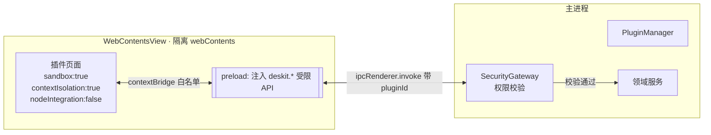
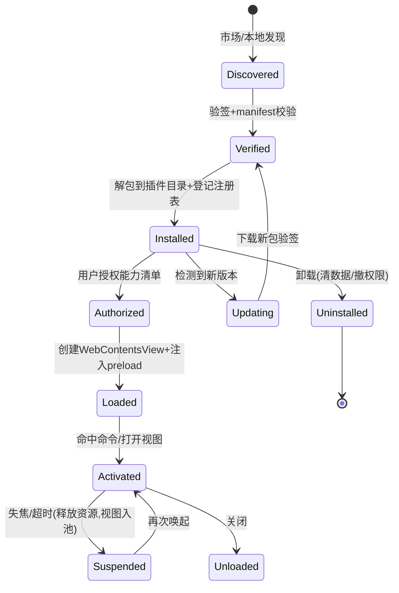
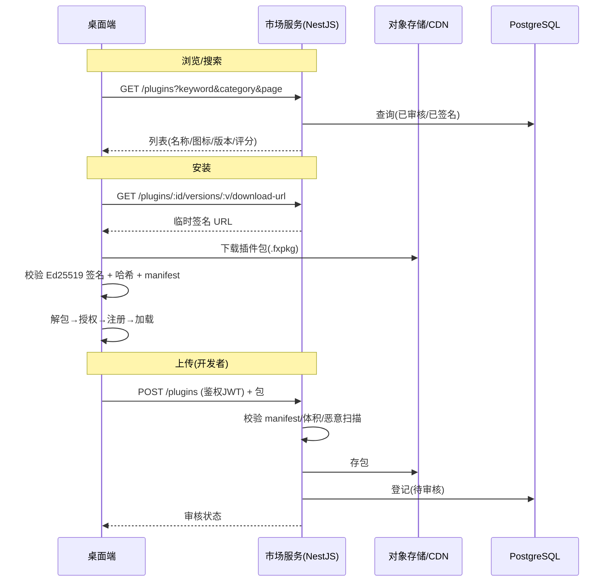
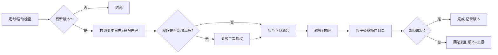

# Deskit 插件系统设计

| 项 | 内容 |
| --- | --- |
| 文档状态 | ✅ Reviewed |
| 版本 | v1.0 |
| 关联 | [架构设计](./architecture.md) · [安全设计](./security.md) · [API/IPC](../03-design/api-ipc.md) · [PRD FR-010~015](../00-product/PRD.md) |

> 本文覆盖课题最高难度挑战群：应用市场、本地开发安装、开发者文档、市场更新、数据安全（FR-010~015，含 ⭐⭐⭐⭐⭐ 项）。

---

## 1. 设计目标与原则

| 目标 | 说明 |
| --- | --- |
| **低门槛** | 前端同学用 HTML/React/JS 即可写插件（对齐 Raycast/uTools） |
| **强隔离** | 插件默认零权限，崩溃不影响主程序，恶意插件无法窃取数据 |
| **可声明** | 能力以 manifest 声明，运行时用户授权（最小权限原则） |
| **可分发** | 市场上传/审核/安装/更新闭环，包完整性可验证 |
| **可演进** | 隔离强度可从 WebContentsView 升级到子进程/VM 而不破坏插件 API |

## 2. 插件形态与分类

| 类型 | 运行方式 | 典型场景 | 权限基线 |
| --- | --- | --- | --- |
| **UI 插件** | `WebContentsView` 加载插件页面 | 时间戳、剪贴板面板、JSON 工具 | 默认仅 UI，无敏感能力 |
| **无界面命令插件** | 在受控环境执行逻辑后回填结果 | 计算、翻译、快捷指令 | 按需声明 |
| **官方内置插件** | 同构但受信任度更高，随主程序分发 | 时间戳/剪贴板/截图/局域网 | 受信任，仍走能力声明 |

## 3. 插件包结构与 Manifest

### 3.1 包结构
```text
my-plugin/
├─ plugin.json          # manifest（核心）
├─ dist/                # 构建产物（index.html / js / css）
├─ assets/icon.png
├─ preload.js          # （可选）插件自带 preload，仍受平台白名单限制
└─ CHANGELOG.md
```

### 3.2 Manifest 规范（`plugin.json`）
```jsonc
{
  "id": "com.deskit.timestamp",       // 反向域名，全局唯一
  "name": "时间戳转换",
  "version": "1.2.0",                  // 语义化版本
  "minHostVersion": "1.0.0",           // 最低宿主版本
  "main": "dist/index.html",           // UI 入口
  "icon": "assets/icon.png",
  "description": { "zh-CN": "时间戳互转", "en-US": "Timestamp converter" },
  "commands": [                        // 注册到命令面板的关键词
    { "keyword": "ts", "title": "时间戳转换", "mode": "view" },
    { "keyword": "now", "title": "当前时间戳", "mode": "no-view" }
  ],
  "permissions": [                     // ★ 能力清单（最小权限）
    "clipboard:read",
    "storage:plugin",
    "network:fetch=https://api.example.com"   // 带 scope 的细粒度声明
  ],
  "i18n": "locales/",
  "author": "dave",
  "signature": "ed25519:..."           // 由市场签发，客户端验签
}
```

### 3.3 权限（能力）模型
能力以 `domain:action[=scope]` 表达，**默认全部拒绝**，需显式声明 + 用户授权：

| 权限 | 含义 | 风险 | 授权时机 |
| --- | --- | --- | --- |
| `clipboard:read` / `clipboard:write` | 读/写剪贴板 | 中 | 安装时提示 + 首次使用确认 |
| `storage:plugin` | 插件私有存储（沙箱内） | 低 | 默认允许 |
| `network:fetch=<origin>` | 仅可访问声明的源 | 高 | 安装时提示，按 origin 限制 |
| `fs:read=<dir>` / `fs:write=<dir>` | 受限目录读写 | 高 | 运行时弹窗授权 |
| `notification` | 系统通知 | 低 | 默认允许 |
| `shell:open` | 打开 URL/文件（不可执行任意命令） | 中 | 确认 |
| `system:clipboard-watch` | 监听剪贴板变化 | 高 | 显式授权 |

> 关键安全红线：**绝不提供 `child_process`/任意 `fs`/任意 `net` 的直通**。所有能力经 `SecurityGateway` 代理与校验（见 [安全设计](./security.md)）。

## 4. 隔离与沙箱架构

### 4.1 主路线（v1.0）：WebContentsView + preload 桥


隔离保证：
- 插件页面**无 Node**、**无 `require`**、**强 CSP**（禁内联脚本、限制连接源到声明的 origin）。
- 通过 `contextBridge` 仅暴露 `window.deskit.*` 白名单 API，**无原型链穿透**。
- 每个 IPC 调用携带不可伪造的 `pluginId`（由主进程在加载时绑定 webContentsId↔pluginId），SecurityGateway 据此鉴权。

### 4.2 演进路线（v1.x）：不可信插件的进程/VM 隔离
对市场下载的**第三方不可信插件**，逻辑型能力进一步隔离：
- **子进程隔离**：插件后台逻辑跑在 `utilityProcess`/子进程，崩溃与内存与主程序隔离，经 MessagePort 通信。
- **`vm` 沙箱**：纯计算型脚本在 Node `vm` 上下文执行，禁用全局对象，CPU/内存配额限制。
- 选择依据：UI 插件保持 WebContentsView；高危/纯逻辑插件下沉到隔离进程。

## 5. 插件生命周期



- **视图池化**：常用插件视图保留在内存池（LRU），冷插件 Suspended 释放，平衡内存与启动速度。
- **热重载（开发者模式 FR-012）**：监听本地插件目录变更 → 重建 webContents → 自动刷新，提供独立 DevTools/控制台。

## 6. 本地插件开发体验（FR-012/013）

### 6.1 SDK 与 CLI
- `packages/plugin-sdk`：导出 `deskit` API 的 TS 类型与运行时桩，本地可类型提示与 mock 调试。
- `create-deskit-plugin` CLI：`pnpm create deskit-plugin my-plugin` 一键生成模板（含 React + manifest + 构建脚本）。
- 文档站点：Hello-World、API 参考、权限说明、发布指南（对标 Raycast 开发者文档质量）。

### 6.2 开发者插件 API 概览（`window.deskit`）
```ts
interface DeskitAPI {
  // 结果与交互
  showToast(opts: ToastOptions): void;
  setSearchResults(items: ResultItem[]): void;     // 无界面命令回填
  closeWindow(): void;
  // 受控能力（均经权限校验）
  clipboard: { read(): Promise<ClipItem>; write(item: ClipItem): Promise<void> };
  storage: { get<T>(k: string): Promise<T>; set(k: string, v: unknown): Promise<void> };
  fetch(url: string, init?: RequestInit): Promise<Response>;  // 受 origin 白名单限制
  fs: { readText(path: string): Promise<string>; /* 受 scope 限制 */ };
  // 平台事件
  onThemeChange(cb: (t: Theme) => void): Dispose;
  i18n: { t(key: string): string; locale: string };
}
```

### 6.3 调试支持
- 开发者模式面板：插件列表、加载状态、能力授权状态、实时日志、性能（内存/调用次数）。
- 错误隔离：插件抛错被捕获并展示在其控制台，不冒泡到主程序。

## 7. 应用市场（FR-010/011）

### 7.1 端-云交互


### 7.2 市场关键能力
- **浏览/搜索/分类/详情**：评分、下载量、版本历史、变更日志、权限清单展示（安装前透明告知所需权限）。
- **上传与审核**：登录鉴权（OAuth2/JWT）；服务端校验 manifest schema、包体积上限、依赖白名单；**自动安全扫描 + 人工审核双轨**（见 [安全设计](./security.md)）。
- **签名**：审核通过后由市场用平台私钥 **Ed25519 签名**，客户端内置公钥验签，杜绝篡改包安装。

## 8. 插件更新（FR-014 ⭐⭐⭐⭐）



- **增量更新**：若包结构支持，按文件 diff 下载（减小包体，NFR-09）；否则全量。
- **原子性与回滚**：新版本解包到临时目录，校验通过后原子切换；失败保留旧版本并回滚。
- **权限变更告知**：更新引入新权限时必须重新授权，防止"更新即提权"攻击。

## 9. 插件注册表与数据隔离
- 本地 `plugins` 表（SQLite）记录：id、版本、来源（market/local/builtin）、授权权限、启停状态、签名指纹。详见 [数据模型](../03-design/data-model.md)。
- 每插件独立存储命名空间（`storage:plugin` 仅能访问 `pluginId` 前缀数据），**插件间数据互不可见**。
- 卸载时清理插件目录 + 存储 + 撤销权限。

## 10. 失败与边界场景
| 场景 | 处理 |
| --- | --- |
| 插件崩溃/死循环 | 视图独立，监控无响应→提示并可强制卸载；CPU/内存配额限制 |
| 验签失败 | 拒绝安装并告警，记录到安全日志 |
| 宿主版本不满足 `minHostVersion` | 拒绝加载并提示升级 |
| 权限被拒 | API 抛 `PermissionDenied`，插件应优雅降级 |
| 网络越权（访问未声明 origin） | CSP + Gateway 双层拦截 |

## 11. 与安全设计的衔接
本插件系统的所有隔离/权限/签名机制，其威胁建模（STRIDE）、Electron 安全基线与服务端防滥用，统一在 [安全设计](./security.md) 中论证；端侧敏感数据加密与同步在 [数据同步设计](./data-sync.md)。
