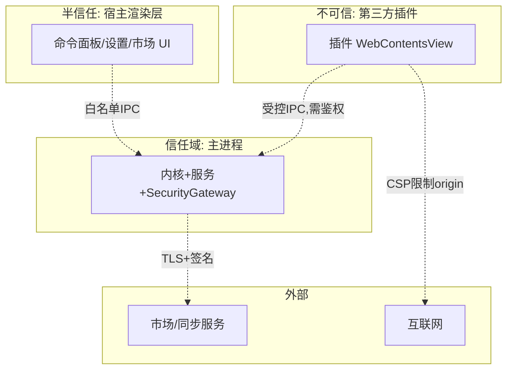
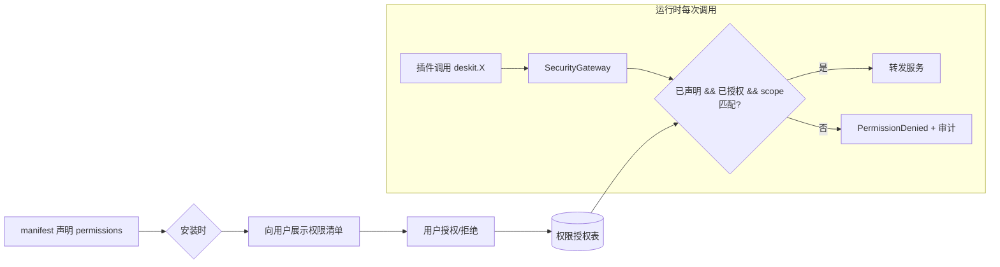

# Deskit 安全设计

| 项 | 内容 |
| --- | --- |
| 文档状态 | ✅ Reviewed |
| 版本 | v1.0 |
| 关联 | [插件系统](./plugin-system.md) · [数据同步](./data-sync.md) · [API/IPC](../03-design/api-ipc.md) · [PRD FR-015/NFR-03/08](../00-product/PRD.md) |

> 直接回应课题最高难度挑战 **FR-015 ⭐⭐⭐⭐⭐：数据安全，防止应用数据被盗取，防止恶意插件攻击服务器**。

---

## 1. 安全目标与威胁面

| 资产 | 威胁 | 安全目标 |
| --- | --- | --- |
| 用户本地数据（剪贴板/设置） | 恶意插件窃取 | 机密性、最小权限 |
| 同步云数据 | 服务端泄露/中间人 | 端到端加密、传输安全 |
| 主程序与系统 | 恶意插件提权/RCE | 隔离、沙箱、能力管控 |
| 应用市场服务 | 恶意上传/滥用/DDoS | 校验、限流、审核、签名 |
| 软件分发 | 安装包/更新包被篡改 | 代码签名、更新验签 |

## 2. 信任边界

红线：**信任随距离核心递减**。插件位于不可信域，所有能力必须穿过 SecurityGateway 鉴权。

## 3. STRIDE 威胁建模

| # | 威胁(STRIDE) | 场景 | 缓解措施 |
| --- | --- | --- | --- |
| T1 | **S**poofing 伪装 | 恶意插件伪造 `pluginId` 调用越权 IPC | 主进程在加载时绑定 `webContentsId↔pluginId`，IPC 由 `event.sender` 反查身份，**客户端无法伪造** |
| T2 | **T**ampering 篡改 | 插件包/更新包被替换植入恶意代码 | Ed25519 **签名验证** + SHA-256 哈希校验；CI 产物签名；`asar` 完整性 |
| T3 | **R**epudiation 抵赖 | 恶意上传者否认行为 | 上传鉴权 + 审计日志（who/when/what）+ 不可变操作记录 |
| T4 | **I**nfo Disclosure 信息泄露 | 插件读取其他插件/用户隐私数据；服务端泄露 | 插件存储命名空间隔离；能力清单授权；同步**端到端加密**，服务端零明文 |
| T5 | **D**oS 拒绝服务 | 恶意插件死循环耗尽资源；恶意请求打垮市场服务 | 插件 CPU/内存配额 + 无响应回收；服务端**限流/配额/WAF**、上传体积上限 |
| T6 | **E**levation 提权 | 插件突破沙箱获得 Node/系统权限 | `sandbox:true`+`contextIsolation:true`+`nodeIntegration:false`；无 `require`；preload 白名单；强 CSP |

## 4. Electron 安全基线（强制 Checklist）

> 全部为**合并门禁**，CI 静态检查（含 `@electron/lint-roller` 思路）：

- [x] 所有 `BrowserWindow`/`WebContentsView`：`contextIsolation: true`
- [x] `nodeIntegration: false`，`nodeIntegrationInWorker/SubFrames: false`
- [x] `sandbox: true`（渲染与插件进程）
- [x] preload 仅经 `contextBridge.exposeInMainWorld` 暴露**最小白名单**，禁止暴露 `ipcRenderer` 原始对象
- [x] 严格 **CSP**：禁 `unsafe-inline`/`unsafe-eval`，`connect-src` 限定到声明 origin
- [x] `webSecurity: true`，不禁用同源策略
- [x] `will-navigate` / `setWindowOpenHandler` 拦截外部导航与 `window.open`，外链走系统浏览器
- [x] 校验 `webContents` 的 `setPermissionRequestHandler`（摄像头/剪贴板等系统权限默认拒绝）
- [x] 不加载远程任意 URL 到具备 preload 的窗口（插件页面来自本地已验签包）
- [x] 关闭 `allowRunningInsecureContent`，强制 HTTPS
- [x] 及时升级 Electron（跟随安全发布），依赖 `pnpm audit` + Dependabot

## 5. 插件能力管控（最小权限落地）

- **默认拒绝**：未声明即无权限；声明也需用户授权。
- **scope 细粒度**：`network:fetch=https://api.x.com` 仅允许该 origin；`fs:read=~/Downloads` 仅该目录。
- **高危二次确认**：`fs:write`、`clipboard-watch`、新增权限的更新（防"更新即提权"，见 [插件更新](./plugin-system.md)）。
- **可视化与撤销**：设置中心展示每插件已授权能力，可随时撤销。

## 6. 网络与传输安全
- 全站 **TLS 1.2+**；证书校验，必要时对自建服务 **证书绑定（pinning）**。
- 客户端-服务端鉴权：**OAuth2/OIDC + 短期 JWT + 刷新令牌**；令牌存 OS 凭据库。
- 插件网络：CSP `connect-src` + Gateway 双层限制到声明 origin，阻断数据外泄通道（防 T4）。

## 7. 服务端防滥用（防"恶意插件攻击服务器"）
| 措施 | 说明 |
| --- | --- |
| 鉴权与 RBAC | 上传/管理需登录与角色校验 |
| 速率限制 | 按 IP/用户/接口限流（令牌桶），防刷与 DoS |
| 上传校验 | manifest schema 校验、体积上限、文件类型白名单、解包炸弹防护（zip bomb） |
| 恶意扫描 | 静态扫描（危险 API 调用、混淆、已知恶意特征）+ 依赖漏洞扫描 |
| 人工审核 | 自动通过低风险，高风险/新作者人工复核（双轨） |
| 签名签发 | 审核通过后平台私钥 Ed25519 签名，私钥 HSM/KMS 保管 |
| 输入校验 | 所有 API DTO 校验（class-validator），防注入；参数化查询（Prisma）防 SQLi |
| 审计与告警 | 关键操作审计日志 + 异常行为告警 |

## 8. 软件供应链与分发安全
- **代码签名**：Windows（Authenticode）/ macOS（Developer ID + 公证 notarization），防系统拦截与篡改。
- **自动更新验签**：`electron-updater` 校验更新包签名，仅信任官方发布密钥（见 [CI/CD](../04-implementation/cicd-release.md)）。
- **构建可信**：CI 在隔离环境构建，锁定 `pnpm-lock.yaml`，依赖来源校验；产物哈希公示。
- **密钥管理**：签名私钥、平台 Ed25519 私钥存 KMS/CI Secret，最小授权，定期轮换。

## 9. 本地数据安全
- 敏感密钥经 OS 凭据库（`keytar`），不落明文。
- 同步数据端到端加密（[数据同步设计](./data-sync.md)）。
- 提供"清除本地数据/退出登录擦除密钥"。

## 10. 安全演进路线
| 阶段 | 强度 |
| --- | --- |
| v1.0 | WebContentsView 隔离 + 能力清单 + 签名 + E2EE + 服务端基线防护 |
| v1.x | 不可信插件**子进程/`vm` 沙箱** + 资源配额硬限制 |
| v2.0 | 插件运行时权限运行画像/异常检测；市场自动化恶意检测增强 |

## 11. 安全测试与门禁
- SAST（CI 静态扫描）、`pnpm audit`/Dependabot、Electron 安全基线脚本化校验。
- 关键安全用例纳入 [测试方案](../05-quality/test-plan.md)：越权 IPC、伪造 pluginId、CSP 绕过、验签失败拒装、限流生效。
- 发布前安全自查清单（本文件 §4/§7）必须全绿。
