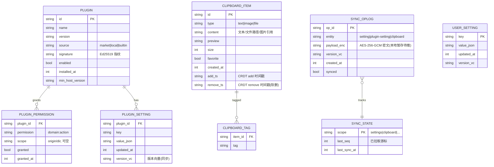
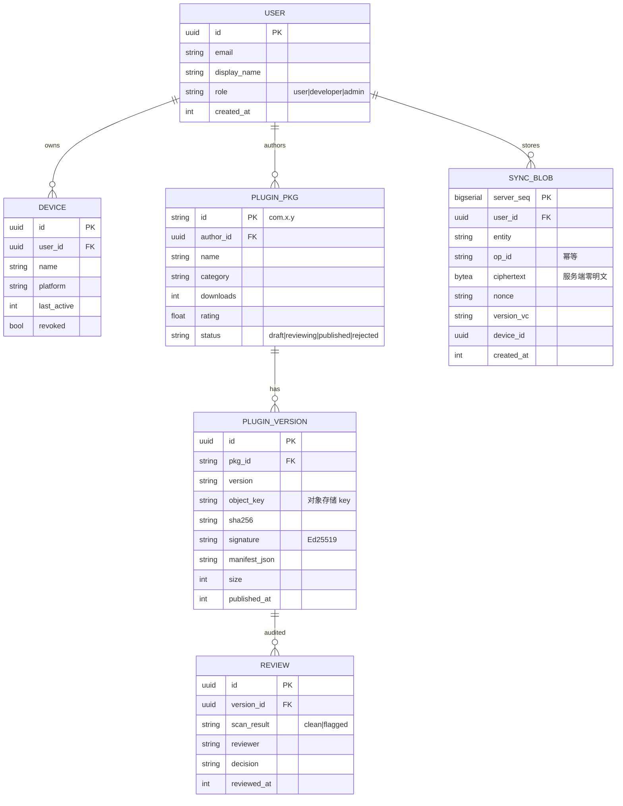

# Deskit 数据模型与存储设计

| 项 | 内容 |
| --- | --- |
| 文档状态 | ✅ Reviewed |
| 版本 | v1.0 |
| 关联 | [架构设计](../02-architecture/architecture.md) · [数据同步](../02-architecture/data-sync.md) · [插件系统](../02-architecture/plugin-system.md) |

涵盖**本地端（SQLite + electron-store + 文件系统）**与**服务端（PostgreSQL）**两套数据模型，及迁移策略。

---

## 1. 存储分工

| 存储 | 内容 | 选型理由 |
| --- | --- | --- |
| `electron-store`（JSON） | 语言/主题/快捷键/开关等标量配置 | 轻量 KV，读写简单，schema 校验 |
| SQLite（better-sqlite3 + Drizzle） | 剪贴板历史、插件注册表、同步 OpLog、权限授权 | 结构化查询/事务/迁移 |
| 文件系统 | 插件包、截图文件、大图缓存 | 二进制大对象不入库 |
| OS 凭据库（keytar） | 同步主密钥/数据密钥/令牌 | 系统级安全存储，不落明文 |

## 2. 本地 SQLite 模型（ER 图）



### 2.1 关键表说明
- **PLUGIN / PLUGIN_PERMISSION**：插件注册表 + 能力授权（落地 [插件系统](../02-architecture/plugin-system.md) 与 [安全设计](../02-architecture/security.md) 的权限模型）。
- **CLIPBOARD_ITEM**：`add_ts/remove_ts` 支撑 CRDT（LWW-Element-Set）软删除与收敛（[数据同步 §4.3](../02-architecture/data-sync.md)）。图片以引用 + 哈希存，文件本体在 FS。
- **SYNC_OPLOG**：本地变更日志，`payload_enc` 为加密后待推 op；`synced` 标记是否已上行。
- **USER_SETTING / PLUGIN_SETTING**：带 `version_vc`（版本向量）支持 LWW 冲突解决。

### 2.2 索引策略
| 表 | 索引 | 目的 |
| --- | --- | --- |
| CLIPBOARD_ITEM | `(type)`, `(favorite)`, `(created_at desc)`, FTS5 全文(`content`) | 分组/收藏/时间线/搜索（< 50ms） |
| SYNC_OPLOG | `(synced)`, `(entity)` | 快速取未同步 op |
| PLUGIN_PERMISSION | `(plugin_id)` | Gateway 鉴权快查 |

> 剪贴板检索用 SQLite **FTS5** 建全文索引，配合应用层拼音匹配，满足中文搜索体验。

## 3. 配置模型（electron-store schema）
```jsonc
{
  "locale": "zh-CN | en-US | system",
  "theme": "light | dark | system",
  "skin": "default | forest | ...",
  "primaryColor": "#3370ff",
  "shortcuts": { "toggleLauncher": "Alt+Space", "capture": "Ctrl+Shift+A" },
  "floatingBall": { "enabled": true, "x": 0, "y": 0, "edge": "right" },
  "sync": { "enabled": false, "provider": "deskit-cloud", "clipboardMaxItems": 200 },
  "telemetry": { "enabled": false }
}
```
- 用 schema 校验（store 内置 JSON Schema），非法值回退默认。
- 同步范围内的配置变更同时写一条 `SYNC_OPLOG`。

## 4. 服务端 PostgreSQL 模型



### 4.1 说明
- **SYNC_BLOB**：服务端只存密文与路由元数据，`server_seq` 单调递增作为客户端拉取游标（[数据同步 §4.1](../02-architecture/data-sync.md)）；`op_id` 唯一约束实现幂等。
- **PLUGIN_VERSION**：记录对象存储 key、哈希、签名、manifest，下载时签发临时 URL（[API §4.1](./api-ipc.md)）。
- **REVIEW**：审核与扫描结果，支撑双轨审核（[安全设计 §7](../02-architecture/security.md)）。

## 5. 数据迁移策略
| 范围 | 工具 | 策略 |
| --- | --- | --- |
| 本地 SQLite | Drizzle Kit migrations | 版本化迁移脚本，启动时检测 `user_version` 自动升级；升级前自动备份 DB 文件，失败回滚 |
| 服务端 PG | Prisma Migrate | CI 中 `migrate deploy`，迁移与发布解耦，向后兼容（先加列后切流量） |
| 配置 | store schema version | 字段变更写迁移函数，旧结构平滑升级 |

迁移原则（大厂实践）：**向后兼容、可回滚、先扩展后收缩（expand-contract）、迁移与代码分步发布**。

## 6. 数据生命周期与隐私
- 剪贴板：默认仅本地；同步开启时按配额（条数/大小）上行；提供"清空历史"。
- 卸载插件：级联清理 `PLUGIN_*` 与插件私有存储命名空间。
- 退出登录：擦除本地密钥与令牌（keytar），保留本地明文数据（用户可选清除）。
- 删除云端：`DELETE /sync/data` 物理删除该用户 `SYNC_BLOB`（隐私权利，NFR-08）。

## 7. 容量与性能预估
| 数据 | 量级假设 | 影响 |
| --- | --- | --- |
| 剪贴板条目 | 单用户 ~万级 | FTS5 + 索引保证检索 < 50ms |
| 插件 | 单用户 ~十级 | 注册表内存可全量缓存 |
| OpLog | 增量、可定期压缩归档 | 已同步 op 定期清理（保留近 N 天） |
| 服务端 SYNC_BLOB | 随用户数线性 | 按 user_id 分区，冷数据归档 |
