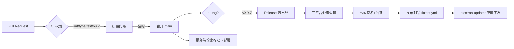
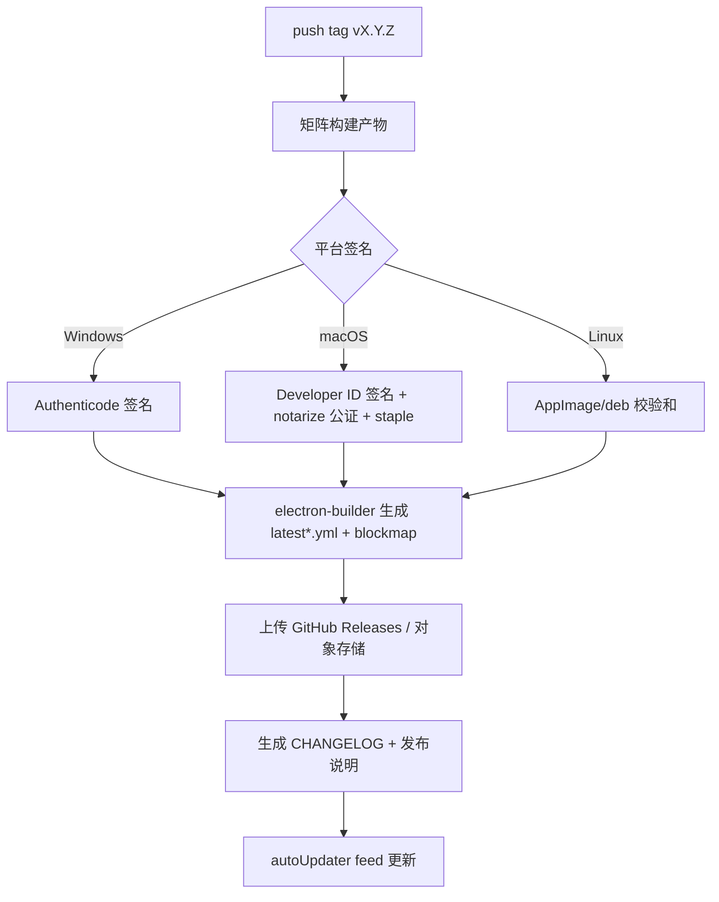
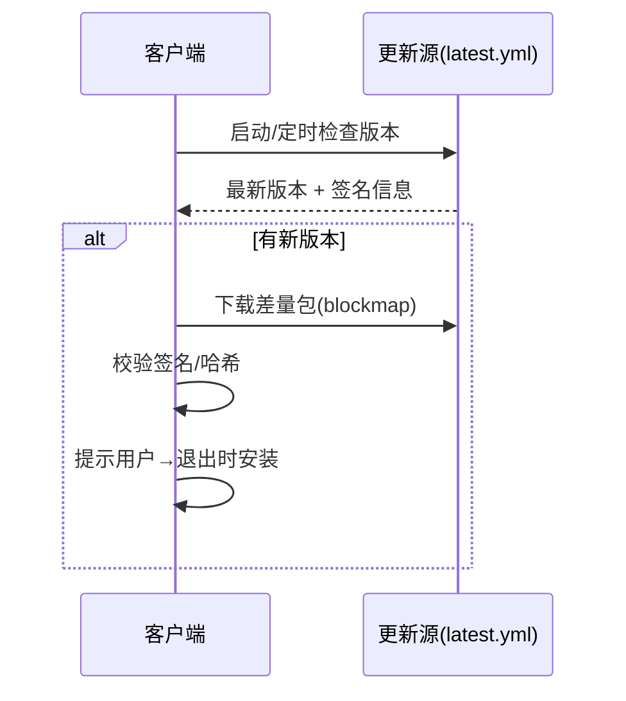

# Deskit CI/CD 与发布流程

| 项 | 内容 |
| --- | --- |
| 文档状态 | ✅ Reviewed |
| 版本 | v1.0 |
| 关联 | [研发规范](./engineering-standards.md) · [测试方案](../05-quality/test-plan.md) · [安全设计](../02-architecture/security.md) · [插件更新](../02-architecture/plugin-system.md) |

> 目标：从提交到分发**全自动、可验证、可回滚**。桌面端三平台构建-签名-公证-发布-自动更新闭环；服务端容器化部署。

---

## 1. 流水线全景



## 2. CI（每个 PR / push）

GitHub Actions，关键 Job（`.github/workflows/ci.yml`）：

| Job | 步骤 | 失败即阻断 |
| --- | --- | --- |
| `lint` | ESLint + Prettier check + commitlint | ✅ |
| `typecheck` | `tsc --noEmit`（全包） | ✅ |
| `test` | Vitest 单元/组件 + 覆盖率阈值 | ✅ |
| `e2e` | Playwright(Electron) 关键链路（仅 PR 到 main） | ✅ |
| `build` | 三平台矩阵 `electron-vite build`（不签名，验证可打包） | ✅ |
| `security` | `pnpm audit` + Electron 安全基线脚本 + SAST | ✅(高危) |

- **Turborepo 增量**：只跑受影响包的任务，配合远程缓存加速。
- **矩阵**：`os: [windows-latest, macos-latest, ubuntu-latest]`。
- **并发**：同分支取消过期运行（`concurrency`）。
- 覆盖率门禁：核心模块 ≥ 70%（[测试方案](../05-quality/test-plan.md)）。

```yaml
# 摘要示例 .github/workflows/ci.yml
on: { pull_request: {}, push: { branches: [main] } }
jobs:
  verify:
    strategy: { matrix: { os: [windows-latest, macos-latest, ubuntu-latest] } }
    runs-on: ${{ matrix.os }}
    steps:
      - uses: actions/checkout@v4
      - uses: pnpm/action-setup@v4
      - uses: actions/setup-node@v4
        with: { node-version: 20, cache: pnpm }
      - run: pnpm install --frozen-lockfile
      - run: pnpm turbo run lint typecheck test build
```

## 3. 版本与发布策略
- **语义化版本（SemVer）**：`MAJOR.MINOR.PATCH`，由 Conventional Commits 自动推导（changesets / semantic-release）。
- **发布通道**：
  | 通道 | 触发 | 受众 |
  | --- | --- | --- |
  | `alpha` | 内部分支预发 | 团队/评委 |
  | `beta` | `vX.Y.Z-beta.N` tag | 早鸟用户 |
  | `stable` | `vX.Y.Z` tag | 全量 |
- **灰度**：stable 先按比例放量（`electron-updater` 的分阶段/`stagingPercentage`），监控崩溃率达标后全量。

## 4. Release 流水线（打 tag 触发，`release.yml`）



- **打包**：`electron-builder`（Windows `nsis`、macOS `dmg`+`zip`、Linux `AppImage`+`deb`）。
- **签名密钥**：存 GitHub Secrets/KMS，最小授权，不落仓库（见 [安全 §8](../02-architecture/security.md)）。
- **产物完整性**：生成 `blockmap` 支持**差量更新**（减小更新包，NFR-09）；公示 SHA-256。

## 5. 自动更新（electron-updater）

- 校验更新包**签名**，仅信任官方发布密钥，防篡改（[安全 §8](../02-architecture/security.md)）。
- 失败回滚：安装失败保留旧版本；更新源不可用则跳过不阻塞启动。
- 与**插件更新**区分：应用本体走 electron-updater；插件更新走市场流程（[插件系统 §8](../02-architecture/plugin-system.md)）。

## 6. 服务端部署（apps/server）
- 容器化：多阶段 `Dockerfile`，产出最小镜像。
- 流水线：构建镜像 → 推送 registry → `prisma migrate deploy`（向后兼容迁移）→ 滚动发布（健康检查）。
- 环境：`dev / staging / prod`，配置经环境变量/密钥管理注入，不入仓。
- 可观测：服务端接入日志聚合 + 指标（QPS/延迟/错误率）+ 告警；限流与 WAF（[安全 §7](../02-architecture/security.md)）。

## 7. 环境矩阵
| 环境 | 用途 | 数据 | 更新通道 |
| --- | --- | --- | --- |
| dev | 本地开发 | mock/本地 PG | 不适用 |
| staging | 集成/预发验证 | 脱敏数据 | beta |
| prod | 线上 | 真实 | stable（灰度） |

## 8. 回滚与应急
| 场景 | 措施 |
| --- | --- |
| 客户端发版后崩溃率飙升 | 停止灰度放量；发布 hotfix tag；必要时下线 latest.yml 指回旧版本 |
| 服务端故障 | 回滚到上一个镜像 tag；迁移用 expand-contract 保证可回滚 |
| 插件恶意/故障 | 市场下架 + 客户端拉黑名单（签名指纹），阻止安装/加载 |

## 9. 发布前检查单（Release Checklist）
- [ ] CI/E2E 全绿，覆盖率达标
- [ ] 安全基线 + SAST + 依赖审计通过（[安全 §4/§11](../02-architecture/security.md)）
- [ ] 三平台手动冒烟（启动/唤起/核心插件）
- [ ] 性能指标达标（启动<2s、唤起<300ms、内存<200MB）
- [ ] 签名/公证成功，更新源可用
- [ ] CHANGELOG / 发布说明就绪
- [ ] 回滚预案确认
