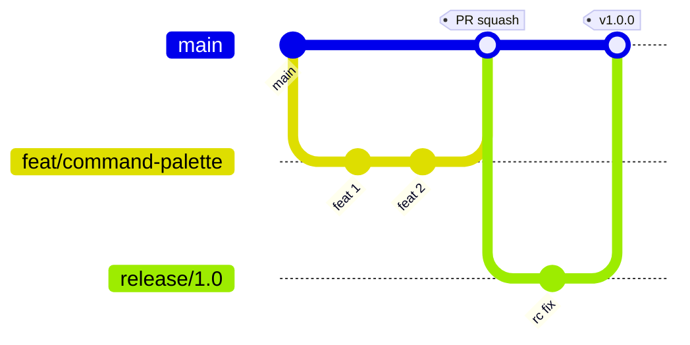

# Deskit 研发规范

| 项 | 内容 |
| --- | --- |
| 文档状态 | ✅ Reviewed |
| 版本 | v1.0 |
| 适用 | 全体研发，强制（CI 门禁） |
| 关联 | [CI/CD](./cicd-release.md) · [测试方案](../05-quality/test-plan.md) · [实施规划](./roadmap.md) |

> 目标：用统一规范换取**可读、可维护、可协作、可回溯**的代码库，对标大厂工程纪律。规范尽量**自动化执行**（lint/hook/CI），减少人肉约束。

---

## 1. 分支模型（Trunk-Based + 短期特性分支）



| 分支 | 用途 | 规则 |
| --- | --- | --- |
| `main` | 始终可发布 | 受保护，禁直推，PR + CI 全绿 + 1 Review 才合并 |
| `feat/*` `fix/*` `chore/*` | 短期特性/修复 | 从 main 切出，存活 < 3 天，合并用 squash |
| `release/x.y` | 版本冻结/回归 | 仅修 bug，回合 main |
| `hotfix/*` | 线上紧急修复 | 从 tag 切出，修复后回合 main |

- 分支命名：`<type>/<short-desc>`，如 `feat/clipboard-sync`。
- 小步快跑，避免长命大分支引发地狱合并。

## 2. 提交规范（Conventional Commits）
格式：`<type>(<scope>): <subject>`
```
feat(launcher): 支持拼音首字母搜索
fix(sync): 修复版本向量比较的 tiebreaker 错误
docs(arch): 补充插件沙箱时序图
```
- `type` ∈ feat/fix/docs/style/refactor/perf/test/build/ci/chore/revert
- `scope` ∈ launcher/plugin/sync/clipboard/market/security/capture/lan/ci...
- 由 `commitlint` + `husky` 在 `commit-msg` 钩子强制；用于自动生成 CHANGELOG 与语义化版本。

## 3. 代码风格与质量门禁
| 工具 | 作用 | 触发 |
| --- | --- | --- |
| TypeScript `strict` | 类型安全（禁 `any`，用 `unknown`+收窄） | 编译/CI |
| ESLint（typescript-eslint + react-hooks + import） | 静态规则 | pre-commit(lint-staged) + CI |
| Prettier | 统一格式 | pre-commit |
| EditorConfig | 编辑器一致（缩进/换行 LF） | 编辑器 |
| pnpm audit / Dependabot | 依赖漏洞 | CI/定时 |

关键规则：
- 禁用 `any`、`@ts-ignore`（如必须用 `@ts-expect-error` + 原因注释）。
- 禁止跨层直接 import（用层边界约束，如 `eslint-plugin-boundaries`）：表现层不得直接 import 基础设施。
- 渲染层禁止 import Node 内置模块（`no-restricted-imports`），强制走 IPC。
- 函数/文件复杂度阈值，超限需拆分。

## 4. 代码评审（Code Review）规范
- **每个 PR 必须 ≥1 人 Review + CI 全绿**；安全/协议改动需对应 owner（安全/架构）评审。
- PR 模板：变更说明、关联 `FR/Issue`、自测情况、风险与回滚、截图/录屏（UI 改动）。
- PR 大小：建议 < 400 行 diff，过大拆分。
- Review 关注点清单：
  - [ ] 是否符合需求 AC、边界与异常处理
  - [ ] 是否破坏 IPC/协议契约，类型是否同步
  - [ ] 安全：是否引入新权限/越权/未校验输入（[安全 §4](../02-architecture/security.md)）
  - [ ] 性能：是否阻塞主进程/主线程、是否有内存泄漏
  - [ ] 可测试性与测试覆盖
  - [ ] 无硬编码文案（i18n）、无调试残留、无密钥泄露
- 评审文化：对事不对人，给出可执行建议；`nit:` 标注非阻塞建议。

## 5. 目录与命名约定
- 包内分层目录见 [架构 §6](../02-architecture/architecture.md)。
- 文件命名：组件 `PascalCase.tsx`，工具/服务 `camelCase.ts`，常量 `SCREAMING_SNAKE`。
- 不写无意义注释；仅在 **why 非显然** 时注释（约束/坑/反直觉）。
- 共享类型放 `packages/shared`，IPC 契约放 `packages/ipc-contract`，**禁止在 app 内重复定义跨端类型**。

## 6. 依赖管理
- 统一 `pnpm`，锁 `pnpm-lock.yaml`，禁止混用包管理器。
- 新增依赖需在 PR 说明理由，评估体积/许可证/维护活跃度（影响包体 NFR-09）。
- 原生模块（better-sqlite3 等）需验证三平台预编译/`electron-rebuild`。

## 7. Git Hooks（husky）
| 钩子 | 动作 |
| --- | --- |
| pre-commit | lint-staged（ESLint+Prettier 仅改动文件） |
| commit-msg | commitlint 校验提交信息 |
| pre-push | 跑受影响包的单测（Turbo 增量） |

## 8. 文档即代码（Docs as Code）
- 文档与代码同仓、同 PR 维护；改协议/架构必须同步 `docs/`。
- 重大决策走 ADR（见 [技术选型](../01-tech-selection/tech-selection.md)）。
- 图用 Mermaid 内嵌，保证可 diff、可评审。

## 9. 协作与可观测纪律
- 日志分级（error/warn/info/debug），生产默认 info；禁止 `console.log` 入主干（lint 拦截）。
- 错误必须带错误码与上下文，便于 Sentry 聚合。
- 性能敏感路径加埋点（唤起延迟、搜索耗时），可关闭遥测。

## 10. 新人 Onboarding（30 分钟可跑通）
```bash
pnpm install
pnpm dev            # 启动桌面端（electron-vite HMR）
pnpm --filter server dev   # 启动服务端
pnpm test           # 跑单测
pnpm lint && pnpm typecheck
pnpm create deskit-plugin demo   # 生成示例插件
```
配合 [README 导航](../README.md) 与 [架构](../02-architecture/architecture.md)，新成员可当天产出第一个 PR。
