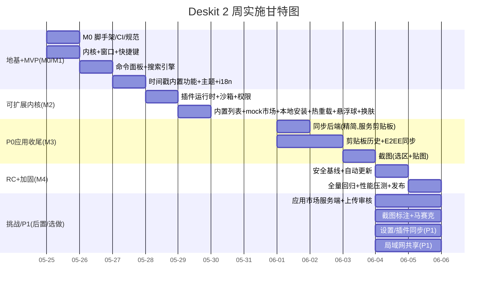

# Deskit 实施规划（里程碑 / Sprint / WBS）

| 项 | 内容 |
| --- | --- |
| 文档状态 | ✅ Reviewed |
| 版本 | v1.0 |
| 周期假设 | 2 周 / 10 个工作日（4 个里程碑，按天推进，单 Sprint），团队 8 人 |
| 关联 | [PRD](../00-product/PRD.md) · [架构](../02-architecture/architecture.md) · [测试方案](../05-quality/test-plan.md) · [风险](../05-quality/risk-management.md) |

> 排期遵循"**先骨架后血肉、先主链路后增量、安全与质量内建**"。每里程碑产出**可演示、可测试**的增量（潜在可交付）。

---

## 1. 里程碑总览

| 里程碑 | 工作日 | 主题 | 交付物（Demo 可演示） | 退出标准 |
| --- | --- | --- | --- | --- |
| **M0 脚手架** | D1 | 工程地基 | Monorepo + CI + 空壳应用启动 | CI 全绿、一键启动 |
| **M1 MVP** | D1–D3 | 主链路 | 快捷键→命令面板→时间戳功能（内置 Provider）+ 深浅色/多语言 | FR-001/002/004/005 + 时间戳 通过验收 |
| **M2 Alpha** | D4–D5 | 可扩展内核 | 插件系统(加载/隔离) + 内置列表 + mock registry + 本地开发安装 + 悬浮球 + 换肤 | FR-003/006/010/012 + 插件加载/隔离通过 |
| **M3 Beta** | D6–D8 | P0 应用收尾 | 剪贴板(含 E2EE 同步) + 截图(选区/贴图) | FR-040~043/060/061 通过（三个 P0 应用齐备） |
| **M4 RC/1.0** | D9–D10 | 收尾加固 + 发布（挑战/P1 后置） | 安全基线 + 自动更新 + 全量回归发布；行有余力再做应用市场服务端(挑战)、市场更新、截图标注/马赛克、数据同步(P1)、局域网(P1) | 安全基线 + 全量回归通过；挑战/P1（FR-011/014/015/062/063/030/031/050/051）尽力交付，不阻塞发布 |

## 2. WBS（工作分解，映射到需求与负责人占位）

> 任务粒度 ≤ 2 人日；`[FR-xxx]` 为可追溯需求；DoD 见 §4。

### M0 脚手架（D1）
- T0.1 初始化 pnpm workspaces + Turborepo + TS 配置
- T0.2 electron-vite 三端工程（main/preload/renderer）跑通空壳
- T0.3 ESLint/Prettier/commitlint/husky + EditorConfig
- T0.4 GitHub Actions：lint+typecheck+test+build 矩阵（见 [CI/CD](./cicd-release.md)）
- T0.5 `packages/shared` `packages/ipc-contract` 骨架 + 类型安全 IPC 封装

### M1 MVP（D1–D3）
- T1.1 WindowManager：主窗预热/居中/失焦隐藏 `[FR-001]`
- T1.2 globalShortcut 唤起 + 可配置快捷键 `[FR-001]`
- T1.3 CommandRouter + **CommandProvider 契约**（`query()`/`run()`，内置/计算 Provider；契约下沉至 `packages/ipc-contract`，作为内置功能与未来插件的**统一稳定接口**）`[FR-002]`
- T1.4 SearchEngine：Fuse.js + 拼音匹配 + 频率排序 `[FR-002]`
- T1.5 命令面板 UI（输入/列表/键盘导航/虚拟列表）`[FR-002]`
- T1.6 主题系统：设计令牌 + 深浅色 + 跟随系统 `[FR-005]`
- T1.7 i18n：i18next + 中英资源 + 运行时切换 `[FR-004]`
- T1.8 时间戳功能（**内置 CommandProvider，非插件**）：互转/秒毫秒/时区，结果内联展示 `[FR-020~023]`
- T1.9 单测：SearchEngine/时间戳逻辑（覆盖率≥70%）

> **架构说明（避免返工）**：M1 不引入插件运行时（WebContentsView/沙箱/manifest）。时间戳通过 T1.3 的 `CommandProvider` 契约以**内置 Provider** 接入——该契约即"内置功能与插件平权接入"的稳定缝（见 [architecture §Provider 模式](../02-architecture/architecture.md)）。M2 插件系统**复用同一契约**，故时间戳可在 M2 以极低成本"毕业"为 `plugins/timestamp` 官方示范插件（dogfooding），无需推倒重写。

### M2 Alpha（D4–D5）
- T2.1 PluginManager：扫描/加载/生命周期 `[FR-010]`
- T2.2 WebContentsView 视图池 + preload 桥（`window.deskit`）`[安全基线]`
- T2.3 SecurityGateway：能力清单解析 + 鉴权 + scope `[FR-015 基线]`
- T2.4 权限授权 UI + 授权持久化 `[FR-015 基线]`
- T2.5 本地开发安装 + 文件监听热重载 + 插件控制台 `[FR-012]`
- T2.6 plugin-sdk + `create-deskit-plugin` CLI + 文档 Demo `[FR-013]`
- T2.7 悬浮球窗口：透明置顶/拖拽吸边/多屏 `[FR-003]`
- T2.8 换肤：多主题 + 自定义主色 + 插件继承 `[FR-006]`
- T2.9 插件隔离/越权 IPC 安全用例
- T2.10 内置插件列表 UI（分类/搜索/启停/卸载）+ **mock JSON registry** 浏览/安装本地包 `[FR-010]`

### M3 Beta（D6–D8）—— P0 应用收尾（剪贴板 + 截图）
- T3.1 同步后端（精简，NestJS + Prisma + PG）：pull/push/游标/幂等/限流，**仅服务剪贴板同步** `[FR-043 依赖]`
- T3.2 端侧 SyncEngine：OpLog/增量/LWW/版本向量 `[FR-043 依赖]`
- T3.3 E2EE：Argon2id KDF + AES-256-GCM + keytar `[NFR-08]`
- T3.4 剪贴板服务：监听/多类型/分组/收藏 + FTS5 检索 `[FR-040~042]`
- T3.5 剪贴板 CRDT 同步 `[FR-043]`
- T3.6 截图基础：desktopCapturer + 选区遮罩 + 多屏 + 贴图置顶窗 `[FR-060/061]`

> 应用市场服务端（真实浏览/上传/安装/审核/Ed25519 签名）按课题定位为【挑战】，**不在 M3 P0 承诺内**——P0 插件机制已由 M2 的"内置列表 + mock registry"（T2.10）满足。市场服务端见 §M4 后置项 T4.4。

> D9–D10 优先保收尾加固与发布（下列 T4.1~T4.3 为承诺项）；挑战/P1 项（T4.4~T4.10）仅在 P0 全绿且行有余力时做，否则后置到 1.0 后，不阻塞发布。

**承诺项（P0 收尾 + 发布）**
- T4.1 安全基线：CSP/能力清单校验/最小权限/限流 checklist `[FR-015 基线]`
- T4.2 自动更新：electron-updater + 灰度通道 `[发布]`
- T4.3 全量回归 + 性能压测（启动/唤起/内存）+ 发布打包签名公证

**后置/选做项（挑战与 P1，工期紧则跳过）**
- T4.4 应用市场服务端（挑战⭐⭐⭐）：NestJS 市场 API（列表/详情/下载签名 URL）+ 上传审核流 + Ed25519 签发 + 端侧市场 UI + 安装链路（下载→验签→解包→授权→注册）`[FR-011]`
- T4.5 市场更新（P1 挑战⭐⭐⭐⭐）：检测/差异授权/原子替换/回滚 `[FR-014]`
- T4.6 服务端防滥用（P1 挑战⭐⭐⭐⭐⭐）：限流/扫描/签名校验加固 `[FR-015]`
- T4.7 截图标注（挑战）：矩形/箭头/画笔/文字/序号 + 撤销重做 `[FR-062]`
- T4.8 马赛克（挑战）：选区打码（像素化/模糊）`[FR-063]`
- T4.9 设置/插件同步（P1，复用 M3 同步基建）`[FR-030/031]`
- T4.10 局域网（P1）：mDNS 发现 + WebSocket/WebRTC 传输 + 进度 `[FR-050/051]`

## 3. Sprint 节奏与仪式（单 Sprint / 2 周）
> 2 周作为一个 Sprint，节奏压缩到天级；周中（D5）做一次中期校准 + Go/No-Go。

| 仪式 | 时点 | 产出 |
| --- | --- | --- |
| Sprint Planning | D1 上午 | Sprint Backlog + 目标 |
| Daily Standup | 每日 15min | 阻塞同步 |
| Backlog Refinement | 每日尾声 | 次日任务拆分/估点 |
| 中期校准（Mid-Sprint Review） | D5 | 进度/范围校准 + Go/No-Go 是否降级 P1 |
| Sprint Review/Demo | D10 | 可演示增量 |
| Retrospective | D10 | 改进项 |

看板列：`Backlog → Todo → In Progress → In Review → Testing → Done`。WIP 限制防止并行过多。

## 4. 完成定义（Definition of Done）
一个任务"完成"必须满足：
- [x] 功能符合对应 `FR/AC`，本地自测通过
- [x] 单测/必要 E2E 覆盖，CI 全绿（lint/type/test/build）
- [x] 代码经至少 1 人 Review 合并（见 [研发规范](./engineering-standards.md)）
- [x] 涉及 IPC/协议变更已更新 `ipc-contract`/`shared` 与文档
- [x] 安全相关改动通过安全 checklist（[安全设计 §4](../02-architecture/security.md)）
- [x] 国际化文案走 i18n，无硬编码
- [x] 关联文档/CHANGELOG 更新

## 5. 资源与角色（RACI 摘要）
| 工作流 | 负责(R) | 批准(A) | 咨询(C) | 知会(I) |
| --- | --- | --- | --- | --- |
| 需求/范围 | PM | Tech Lead | 研发/设计 | 全员 |
| 架构/选型 | Architect | Tech Lead | 研发 | 全员 |
| 桌面端开发 | 前端工程师 | Tech Lead | Architect | QA |
| 服务端开发 | 后端工程师 | Tech Lead | 安全 | QA |
| 安全 | 安全负责人 | Tech Lead | 研发 | 全员 |
| 测试/质量 | QA | Tech Lead | 研发 | PM |
| 发布 | DevOps | Tech Lead | QA | 全员 |

## 6. 里程碑验收与降级预案
- 每里程碑末做 **Go/No-Go 评审**，对照退出标准；2 周排期下额外在 **D5 中期校准**集中决定是否降级 P1。
- **范围保护（2 周工期下尤为关键）**：按优先级降级——优先保可扩展内核（插件加载/内置列表/mock registry/隔离）+ 三个 P0 内置应用（时间戳/剪贴板/截图）的基础能力 + 1~2 个差异化亮点（拼音搜索/安全沙箱）；**挑战与 P1 项默认后置/选做**：应用市场服务端（上传/安装/审核）、市场更新、截图标注/马赛克、数据同步（设置/插件，P1）、局域网共享（P1），仅在 P0 全绿且行有余力时实现。注意剪贴板基础记录/分组/收藏与跨设备 E2EE 同步均为 P0，仅在工期极紧时其同步可临时降为仅本地。降级决策记入 [风险登记册](../05-quality/risk-management.md)。
- Linux 平台定位为"尽力支持"，不阻塞 1.0（见风险 R-07）。
