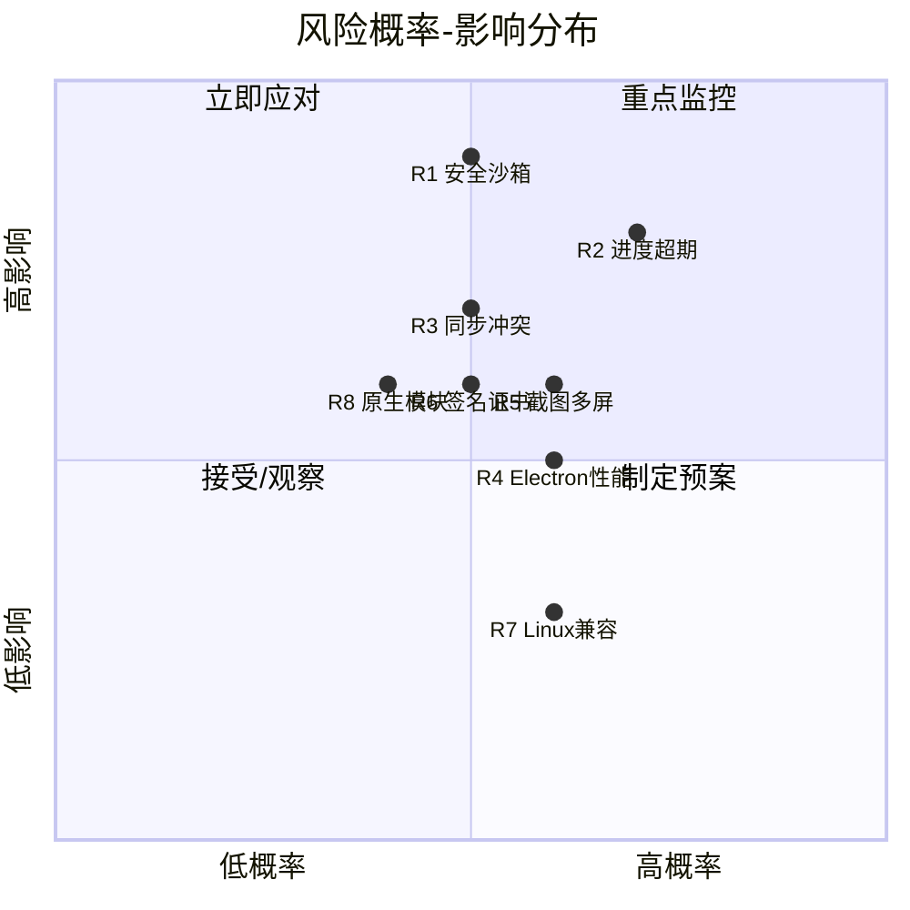
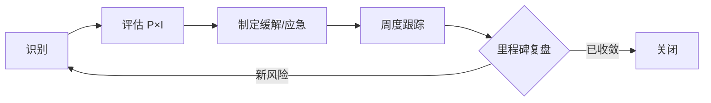

# Deskit 风险登记册（Risk Register）

| 项 | 内容 |
| --- | --- |
| 文档状态 | ✅ Reviewed |
| 版本 | v1.0 |
| 关联 | [实施规划](../04-implementation/roadmap.md) · [安全设计](../02-architecture/security.md) · [技术选型](../01-tech-selection/tech-selection.md) |

> 风险按 **概率(P) × 影响(I)** 评级（各 1~5），暴露值 = P×I。≥12 为高风险（红），6~11 中（黄），≤5 低（绿）。每条含负责人、缓解、应急（contingency）与触发信号。

---

## 1. 风险热力图

## 2. 风险登记表

| ID | 类别 | 风险描述 | P | I | 暴露 | 等级 | 缓解措施 | 应急预案 | 负责人 |
| --- | --- | --- | :-: | :-: | :-: | :-: | --- | --- | --- |
| **R1** | 安全 | 插件沙箱被绕过，恶意插件窃取数据/攻击服务器（FR-015 最高难度） | 3 | 5 | 15 | 🔴 | 默认零权限+能力清单+签名+CSP+Gateway 鉴权（[安全设计](../02-architecture/security.md)）；安全用例纳入 CI | 一阶段先保 WebContentsView 隔离，进程/VM 沙箱延后；发现漏洞即热修+市场拉黑 | 安全 |
| **R2** | 进度 | 仅 2 周工期，功能过多，挑战项（标注/CRDT/局域网）超期 | 5 | 4 | 20 | 🔴 | 严格里程碑+DoD；先 P0 主链路+1~2 差异化亮点；D5 中期校准 + D10 Review 校准 | 范围降级：P1/挑战项（截图标注/马赛克、数据同步(设置/插件,P1)、局域网）默认后置/选做；剪贴板/截图为 P0 不可砍（[roadmap §6](../04-implementation/roadmap.md)） | PM+TL |
| **R3** | 技术 | 多端并发同步冲突导致数据丢失/不一致 | 3 | 4 | 12 | 🔴 | 标量 LWW+列表 CRDT，收敛性单测；幂等 op；可视化冲突 | 关闭自动合并改手动确认；保留本地备份可恢复 | 后端 |
| **R4** | 性能 | Electron 启动/内存劣于原生，达不到 NFR-01 | 3 | 3 | 9 | 🟡 | 窗口预热+视图池+懒加载+虚拟列表+Worker；性能打点门禁 | 关键路径上原生插件；降低默认常驻插件数 | 前端 |
| **R5** | 技术 | 截图多屏/高 DPI 坐标错乱、取色不准 | 3 | 3 | 9 | 🟡 | 统一多屏坐标系换算；逐平台验证；DPI 缩放处理 | 引入原生截图插件（ScreenCaptureKit/GDI）兜底 | 前端 |
| **R6** | 合规 | 代码签名证书（Apple/Windows）申请周期长，阻塞发布 | 3 | 3 | 9 | 🟡 | 项目初期即启动申请；CI 预留签名步骤 | 未签名先内部分发+提示；公证后切正式 | DevOps |
| **R7** | 兼容 | Linux 适配成本高，挤占主线进度 | 3 | 2 | 6 | 🟡 | 定位"尽力支持"，不阻塞 1.0；CI 仅构建验证 | 1.0 不承诺 Linux 一等公民，后续迭代 | 前端 |
| **R8** | 技术 | 原生模块（better-sqlite3/keytar）三平台编译/ABI 问题 | 2 | 3 | 6 | 🟡 | CI 三平台预构建+electron-rebuild 验证；锁版本 | 退化为纯 JS 实现（sql.js）或降级存储 | 前端 |
| **R9** | 资源 | 训练营成员经验/精力不均，关键模块单点 | 3 | 3 | 9 | 🟡 | 结对/知识共享；模块文档化；避免单点 owner | 关键模块双备份负责人 | TL |
| **R10** | 安全 | 服务端被恶意上传/刷量/DDoS | 2 | 4 | 8 | 🟡 | 鉴权+限流+扫描+审核+体积上限（[安全 §7](../02-architecture/security.md)） | 临时关闭上传/下架可疑插件 | 后端+安全 |
| **R11** | 范围 | 需求蔓延（competitor 功能照搬过多） | 3 | 3 | 9 | 🟡 | 变更走评审；MVP 边界明确；非目标清单（[PRD §2.2](../00-product/PRD.md)） | 冻结范围，新需求进 backlog 下一迭代 | PM |
| **R12** | 隐私 | 同步/遥测处理不当引发隐私合规问题 | 2 | 4 | 8 | 🟡 | E2EE+默认本地+可关闭遥测+数据导出删除（NFR-08） | 默认关闭同步与遥测，显式授权 | 安全+PM |

## 3. 高风险（🔴）专项跟踪

### R1 安全沙箱（最高优先）
- **触发信号**：安全用例失败、出现可绕过 PoC、依赖 CVE。
- **里程碑挂钩**：M2 必须交付能力清单+Gateway+隔离基线；M4 安全加固周专门验证。
- **度量**：安全测试通过率 100% 才可发布。

### R2 进度超期
- **触发信号**：连续两次 Sprint 燃尽未达标、关键路径任务阻塞 > 2 天。
- **决策机制**：里程碑 Go/No-Go 评审决定是否降级；降级记录入本册与 PRD 范围表。

### R3 同步冲突/数据一致性
- **触发信号**：CRDT 收敛性测试出现不一致、用户报告数据丢失。
- **度量**：并发合并测试（TC-051）必须收敛一致。

## 4. 风险治理流程

- **节奏**：每周更新暴露值与状态；里程碑复盘重评级。
- **升级**：高风险（🔴）在 Sprint Review 必报；阻塞性风险即时升级 Tech Lead/PM。
- **关联**：风险变化反哺 [实施规划](../04-implementation/roadmap.md) 范围与排期调整。

## 5. 假设与依赖（Assumptions & Dependencies）
| 类型 | 内容 | 风险关联 |
| --- | --- | --- |
| 假设 | 团队具备 React/TS 基础，可周内上手 | R9 |
| 假设 | 用户愿注册账号以启用同步 | 影响 G3 指标 |
| 依赖 | 自建服务端（市场+同步）需提前搭建 | R10 |
| 依赖 | 代码签名证书需提前申请 | R6 |
| 依赖 | 对象存储/CDN 资源 | R10 |
