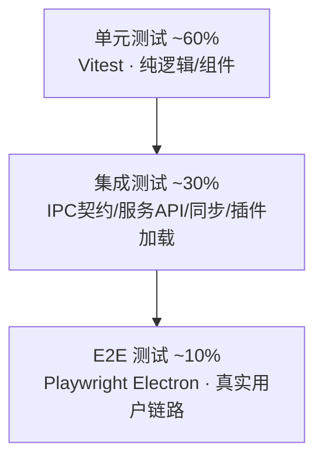

# Deskit 测试方案

| 项 | 内容 |
| --- | --- |
| 文档状态 | ✅ Reviewed |
| 版本 | v1.0 |
| 关联 | [PRD](../00-product/PRD.md) · [CI/CD](../04-implementation/cicd-release.md) · [研发规范](../04-implementation/engineering-standards.md) · [安全设计](../02-architecture/security.md) |

> 质量目标：核心模块单测覆盖率 ≥ 70%，主链路 E2E 全覆盖，每个 `FR-xxx` 至少 1 条 `TC-xxx`，CI 门禁守护。

---

## 1. 测试策略与金字塔

| 层 | 工具 | 范围 | 运行时机 |
| --- | --- | --- | --- |
| 单元 | Vitest + Testing Library | 搜索/排序/时间戳/CRDT/加密/工具函数/React 组件 | 每次提交(增量) |
| 集成 | Vitest + supertest（服务端）/ IPC mock | IPC 契约、市场 API、同步 push/pull、插件加载 | PR |
| E2E | Playwright（Electron） | 唤起→搜索→执行、安装插件、同步、截图 | PR 到 main / 夜间 |
| 专项 | 自研脚本/k6/Lighthouse-like | 性能、安全、兼容、可访问性 | 里程碑/发布前 |

## 2. 各类型测试要点

### 2.1 单元测试
- **纯逻辑优先**：SearchEngine 排序、拼音匹配、时间戳/时区换算（含 DST）、版本向量比较、CRDT 合并收敛、AES-GCM 加解密往返。
- **组件**：命令面板键盘导航、主题切换 DOM 属性变更、表单校验。
- 原则：快、确定、无外部依赖；服务用依赖注入便于 mock。

### 2.2 集成测试
- **IPC 契约测试**：对 `ipc-contract` 每个 channel，校验 handler 入参/返回符合类型与 zod；防协议漂移。
- **服务端 API**：市场列表/上传/下载签名、同步 pull/push 幂等与冲突分支、限流 429、鉴权失败 401/403。
- **插件加载**：加载合法插件成功、验签失败拒装、`minHostVersion` 不满足拒载。

### 2.3 E2E 测试（Playwright Electron）
覆盖关键用户旅程（见 §4 用例）：唤起搜索执行、本地插件安装与热重载、市场安装、开启同步两端一致、截图与贴图。

### 2.4 专项测试
| 专项 | 方法 | 指标/门禁 |
| --- | --- | --- |
| 性能 | 启动/唤起/搜索打点；内存采样；大列表压测 | 启动<2s、唤起<300ms、搜索<50ms、空闲内存<200MB（NFR-01） |
| 安全 | 越权 IPC、伪造 pluginId、CSP 绕过、限流、验签 | 全部按预期拦截（[安全 §3/§11](../02-architecture/security.md)） |
| 兼容 | Win10/11、macOS12+、Ubuntu22.04 多分辨率/多屏/高 DPI | 核心链路通过 |
| 可访问性 | 键盘全可达、焦点管理、对比度 | 主流程无障碍可用 |
| 国际化 | 中英切换、文案无溢出、无硬编码 | 100% 走 i18n |

## 3. 测试数据与环境
- 单测：内存 SQLite（`:memory:`）、固定时钟（注入 `now()`）、固定随机源（确定性 nonce）。
- 集成：临时 PG（Testcontainers/Docker）、临时对象存储（MinIO）。
- E2E：测试构建版应用 + mock 同步/市场服务（或 staging）。
- 测试账号与样例插件：`e2e/fixtures/`。

## 4. 关键测试用例（节选，完整见用例库）

| TC | 关联 FR | 场景 | 步骤 | 预期 |
| --- | --- | --- | --- | --- |
| TC-001 | FR-001 | 快捷键唤起 | 任意应用前台按 Alt+Space | 300ms 内主窗居中弹出并聚焦输入 |
| TC-002 | FR-002 | 拼音搜索 | 输入 `sjc` | 命中"时间戳"等拼音首字母匹配项并排序 |
| TC-003 | FR-002 | 即时计算 | 输入 `1+2*3` | 内联展示结果 7，无需回车 |
| TC-010 | FR-020~022 | 时间戳转换 | 输入 13 位毫秒戳 | 正确识别毫秒并显示本地日期时间 |
| TC-011 | FR-023 | 时区换算 | 切换到 UTC | 同一时刻按 UTC 正确换算，DST 正确 |
| TC-020 | FR-005 | 深浅色 | 切换深色 | html data-theme=dark，已开插件同步变色 |
| TC-021 | FR-006 | 换肤 | 改主色为绿色 | CSS 变量更新，主程序+插件主色变绿 |
| TC-030 | FR-012 | 本地插件热重载 | 改插件源文件保存 | 插件视图自动刷新，控制台可见日志 |
| TC-031 | FR-015 | 越权拦截 | 未声明 clipboard 的插件调 read | 抛 PermissionDenied，记安全日志 |
| TC-032 | FR-015 | 验签失败 | 安装被篡改包 | 拒绝安装并告警 |
| TC-040 | FR-010 | 内置列表安装(mock) | 内置列表/ mock registry 搜索→安装本地包→启用 | 解包注册成功，命令面板可用 |
| TC-041 | FR-011 | 上传审核(挑战) | 开发者上传插件 | 服务端校验+扫描，状态=待审核 |
| TC-042 | FR-014 | 插件更新 | 有新版本且新增高危权限 | 提示变更日志+二次授权，原子替换，失败回滚 |
| TC-050 | FR-030/031 | 设置同步 | A 改主题→B 拉取 | B 端主题最终一致（LWW） |
| TC-051 | FR-043 | 剪贴板并发 | A、B 同时增删条目 | 合并后两端收敛一致，无丢失（CRDT） |
| TC-052 | NFR-08 | 端到端加密 | 抓取同步请求体 | 仅密文，服务端无明文 |
| TC-060 | FR-050/051 | 局域网传输 | 同 WiFi 发文件给设备 B | B 确认后落盘，进度正确，大文件可传 |
| TC-070 | FR-060 | 选区截图 | 快捷键→拖拽选区 | 多屏正确，截取选区图像 |
| TC-071 | FR-061~063 | 标注/贴图/马赛克 | 加箭头/打码/钉桌面 | 标注可撤销重做，贴图置顶可拖动 |

## 5. 需求-测试可追溯矩阵（RTM）
| 需求 | 测试用例 | 覆盖 |
| --- | --- | --- |
| FR-001/002 | TC-001/002/003 | ✅ |
| FR-003 | TC-(悬浮球用例) | ✅ |
| FR-004/005/006 | TC-020/021 | ✅ |
| FR-010/011/014/015 | TC-031/032/040/041/042 | ✅ |
| FR-012/013 | TC-030 | ✅ |
| FR-020~023 | TC-010/011 | ✅ |
| FR-030/031/043 | TC-050/051/052 | ✅ |
| FR-040~042 | TC-(剪贴板用例) | ✅ |
| FR-050/051 | TC-060 | ✅ |
| FR-060~063 | TC-070/071 | ✅ |

> CI 阶段校验 RTM 完整性：每个 `FR` 必须关联至少一个通过的 `TC`，否则告警，确保**需求不漏测**。

## 6. 缺陷管理
- 缺陷分级：S1 阻断 / S2 严重 / S3 一般 / S4 轻微。
- S1/S2 阻断发布；修复需补回归用例（防复发）。
- 缺陷流转：`New → Triage → Fixing → Verifying → Closed`，与看板联动。

## 7. 质量门禁与发布关卡
- PR 合并门禁：lint+type+单测+覆盖率+受影响 E2E 全绿（[CI/CD §2](../04-implementation/cicd-release.md)）。
- 里程碑门禁：对应 FR 的 TC 全通过 + 专项达标。
- 发布门禁：全量回归 + 性能/安全达标 + 发布检查单（[CI/CD §9](../04-implementation/cicd-release.md)）。

## 8. 测试自动化与报告
- CI 产出覆盖率报告与 E2E 录像/截图（失败留存 trace）。
- 夜间跑全量 E2E + 性能基线，趋势可视化，回归预警。
